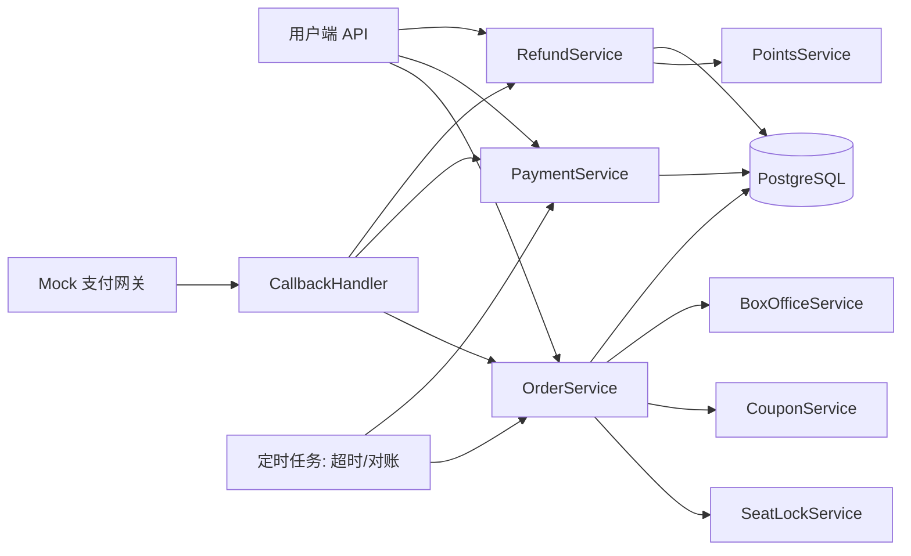
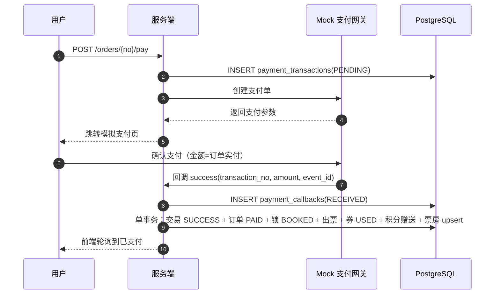
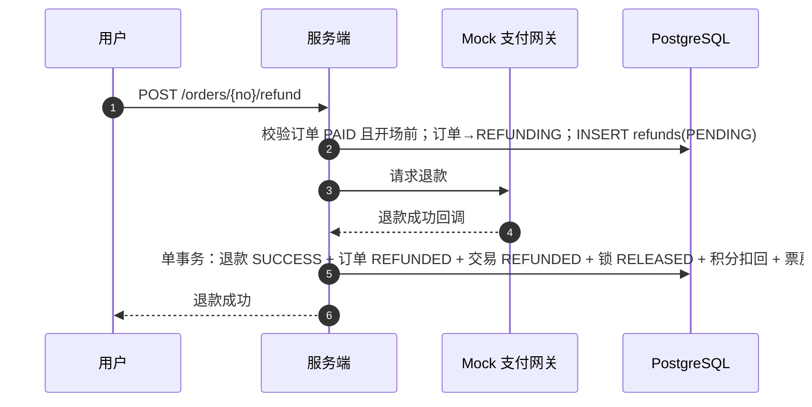

# F0000-订单支付与退款 · FSD（详设 v0.2）

> 定位：PRD M04（F07~F10）的模块详设，面向开发。表结构见 [database/数据库表.md](../database/数据库表.md)，状态机见 [state-machine/状态机.md](../state-machine/状态机.md)，贫血 DDD 方法论见 [guide/业务建模与贫血DDD.md](../guide/业务建模与贫血DDD.md)。
> v0.2：移除钱包/充值，订单直接 Mock 支付直付影院；退款联动积分扣回。
> 命名对齐 potentia/backend：handler → `app/server/http/handler`，service → `app/server/service/order_svc.go`，domain → `core/domain/order.go`，接口 → `core/port/repo.go`，实现 → `infra/database/postgres/order_repo.go`。

## 1. 模块范围

覆盖：订单创建、订单支付（Mock 直付）、支付回调、超时/取消/退款、对账任务、积分赠送与退款扣回。

**不覆盖**：真实支付渠道对接（Mock 网关接口对齐，预留 Provider 接口）、营销（优惠券/积分由本模块事件驱动调用）。

## 2. 模块边界与依赖



- OrderService：订单状态机编排，聚合支付/锁座/券/积分/票房联动。
- PaymentService：支付交易状态机（PENDING/SUCCESS/FAILED/CLOSED/REFUNDED）。
- RefundService：退款单状态机（PENDING/SUCCESS/FAILED）。
- PointsService：积分赠送与扣回，全部走 points_ledger 幂等流水。
- CallbackHandler：统一回调入口，先落回调表，再按 biz_type 分发。
- 定时任务：超时释放、回调重试、对账补齐。

## 3. 关键设计决策

### 3.1 为什么没有钱包

用户直接对影院付款（Mock 支付），不存在虚拟货币，因此没有余额账户与充值单；退款即由 Mock 渠道原路退回。

### 3.2 为什么回调先落库再处理

落库（`payment_callbacks` RECEIVED）使回调成为可重放的持久事件：进程崩溃后任务可从库中恢复，`event_id` 唯一保证不重放。

### 3.3 为什么积分要流水

积分是「赠送值」：支付赠送、退款扣回。流水表记录每一次变动的事实（who/what/when/why），`users.points_balance` 只是冗余快照；幂等键 `(biz_type, biz_no)` 保证同一业务事件只记一次账。没有流水就无法对账，也无法回答「这 100 分哪来的、为什么少了」。

### 3.4 为什么统一 payment_transactions

支付与退款共用同一张交易流水：对账、渠道扩展、审计只改一处；`UNIQUE(biz_type, biz_no)` 天然防一单多付。

## 4. 贫血 DDD 编排示例（Go 伪代码）

贫血模型 = 实体只是「属性 + 状态」，业务规则与流程编排集中在 Application Service；事务边界 = 一个用例一个事务。

```go
// application/service/order_service.go
type OrderService struct {
    tx            *TxManager          // 事务管理器
    orderRepo     OrderRepository     // 仓储：只负责持久化
    seatLockRepo  SeatLockRepository
    couponRepo    CouponRepository
    pointsRepo    PointsRepository
    boxOfficeRepo BoxOfficeRepository
    payRepo       PaymentRepository
}

// HandlePaySuccess 是「支付成功」这个业务事件的编排入口
func (s *OrderService) HandlePaySuccess(ctx context.Context, cb Callback) error {
    // 贫血实体：只承载数据
    order := s.orderRepo.FindByNo(ctx, cb.BizNo)
    if order == nil {
        return ErrOrderNotFound
    }

    // 状态机守卫：状态不允许迁移就拒绝
    if !order.CanTransition(OrderEventPaySuccess) {
        return ErrOrderStateInvalid
    }

    // 一个用例 = 一个事务：所有状态迁移与资源变更原子提交
    return s.tx.Run(ctx, func(tx *sqlx.Tx) error {
        // 1. 回调幂等（event_id 唯一，冲突即返回幂等成功）
        inserted, err := s.payRepo.InsertCallbackIfAbsent(tx, cb)
        if err != nil || !inserted {
            return nil
        }

        // 2. 状态机迁移（乐观锁 version 条件 UPDATE）
        if err := s.orderRepo.Transition(tx, order, OrderEventPaySuccess); err != nil {
            return err
        }
        if err := s.payRepo.MarkSuccess(tx, cb.TransactionNo); err != nil {
            return err
        }

        // 3. 领域副作用：锁座出票、券核销、积分赠送、票房汇总
        if err := s.seatLockRepo.MarkBooked(tx, order.ID); err != nil {
            return err
        }
        if err := s.couponRepo.MarkUsed(tx, order.CouponInstanceID, order.ID); err != nil {
            return err
        }
        if err := s.pointsRepo.Grant(tx, order.UserID, order.PaidCents, order.OrderNo); err != nil {
            return err
        }
        if err := s.boxOfficeRepo.Upsert(tx, order); err != nil {
            return err
        }

        return s.payRepo.MarkCallbackProcessed(tx, cb.EventID)
    })
}
```

**分层规则**：

| 层 | 职责 | 禁止 |
| --- | --- | --- |
| Handler/API | 参数校验、鉴权、响应 | 不写业务逻辑 |
| Application Service | 用例编排、事务边界、幂等 | 不直接拼 SQL |
| Domain（贫血实体） | 属性 + 状态 + `CanTransition` 校验 | 不访问数据库 |
| Repository | 封装 SQL/ORM，条件 UPDATE | 不编排跨表事务 |
| 定时任务 | 超时/对账补偿 | 不绕过状态机 |

## 5. 时序详图

### 5.1 模拟支付购票



### 5.2 退款



## 6. 幂等键清单

| 位置 | 键 | 作用 |
| --- | --- | --- |
| payment_callbacks | event_id | 回调去重 |
| payment_transactions | (biz_type, biz_no) | 一单一付 |
| payment_transactions | (channel, external_trade_no) | 渠道单号去重 |
| points_ledger | (biz_type, biz_no) | 积分赠送/扣回去重 |
| refunds | order_id / refund_no | 一单一退 |
| user_coupons | 状态条件 UPDATE | 并发核销抢占 |
| seat_locks | 部分唯一索引 | 并发锁座防超卖 |
| orders | order_no | 业务单号唯一 |

## 7. 错误码建议

| 场景 | HTTP | 业务码 |
| --- | --- | --- |
| 订单不存在/无权访问 | 404 | ORDER_NOT_FOUND |
| 订单状态不允许该操作 | 409 | ORDER_STATE_INVALID |
| 座位已被抢占 | 409 | SEAT_LOCK_CONFLICT |
| 优惠券不可用/被占用 | 409 | COUPON_STATE_INVALID |
| 金额不一致（回调） | 500 | CALLBACK_AMOUNT_MISMATCH |
| 回调重复 | 200 | CALLBACK_DUPLICATE |
| 订单已支付/已退款 | 409 | ORDER_ALREADY_PAID / ORDER_ALREADY_REFUNDED |
| 退款超时限制 | 409 | REFUND_NOT_ALLOWED |

## 8. 埋点与日志要求

- 关键事件打结构化日志：订单创建/支付/取消、退款创建/成功/失败、回调收到/处理/失败、对账补齐、积分赠送/扣回。
- 日志字段：`trace_id`、`biz_no`、`user_id`、`event_id`、`金额`、`积分变化`、`耗时`。
- 大盘指标（先输出到日志）：回调处理耗时、幂等冲突次数、对账补单次数、积分扣回告警（余额 < 0 防御）。

## 9. 测试要点

1. 并发同座锁座：两协程同时锁同一座位，仅一个成功。
2. 重复回调：同一 event_id 发送两次，订单/积分/票房只变一次。
3. 退款重复：同一订单并发退款，只创建一个 refunds（order_id 唯一）。
4. 退款扣积分：退款金额 50% 则积分扣回 50%，流水为负且唯一。
5. 状态机全迁移表：合法迁移通过，非法迁移返回 409。
6. 事务中断模拟：出票中途 panic，对账任务补齐且不重复。
