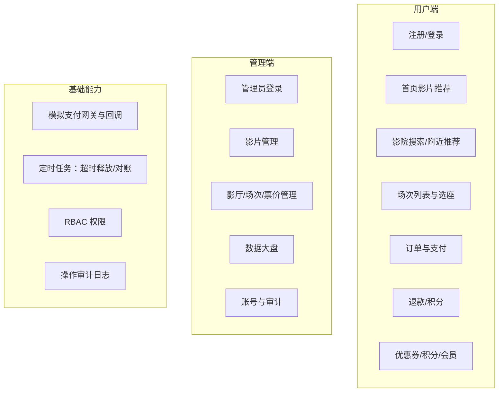
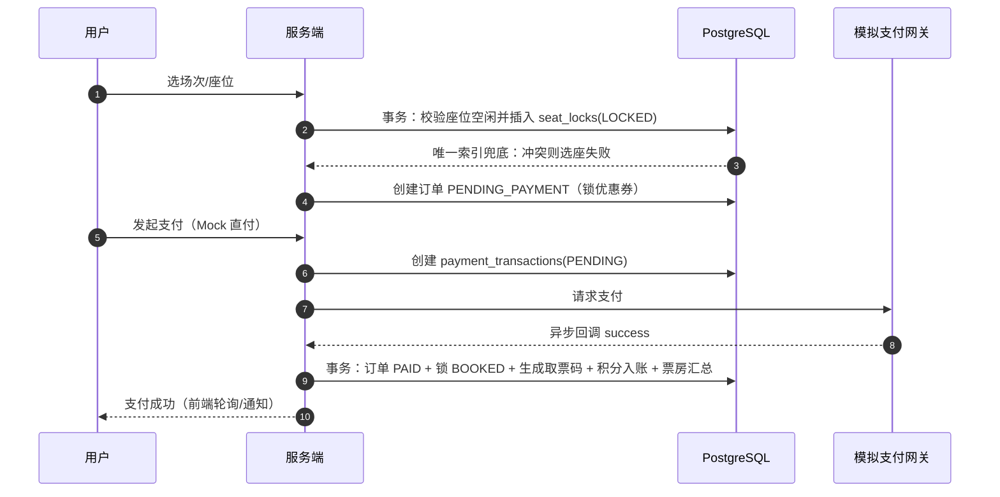
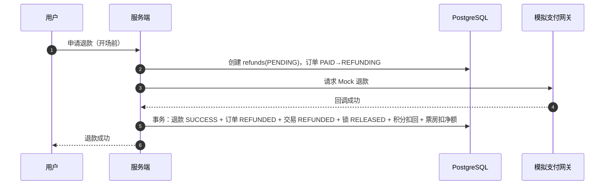
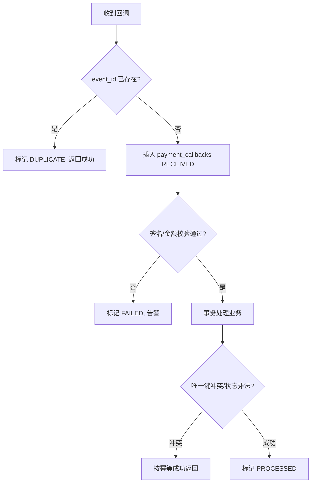
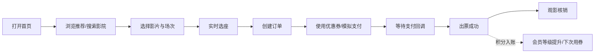
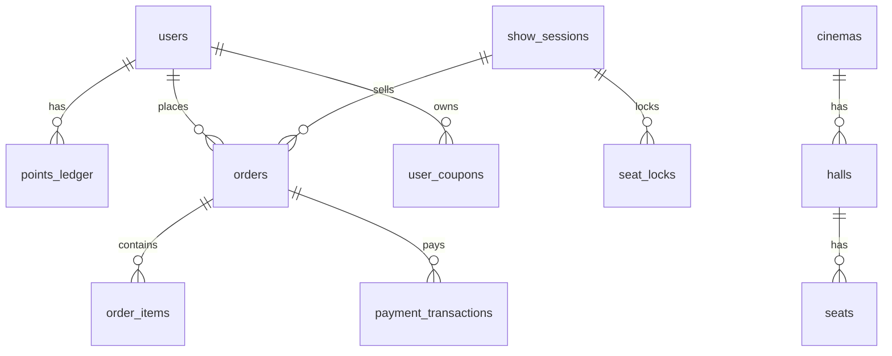
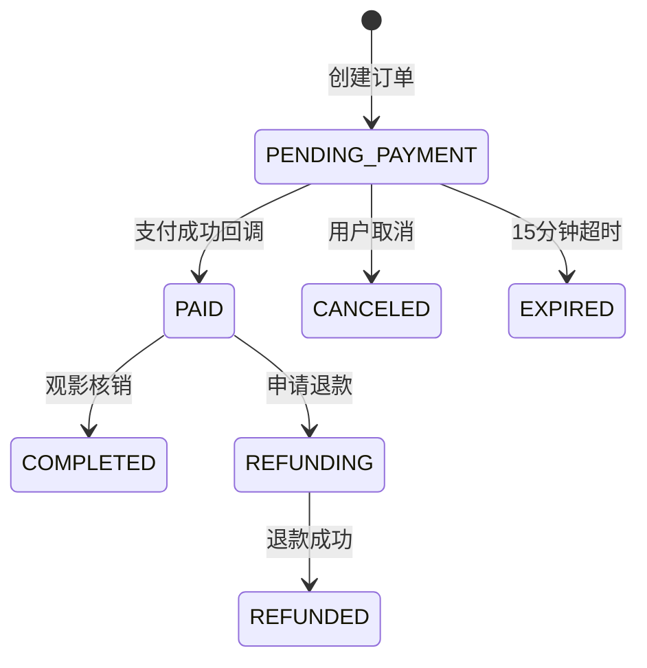

# P0000-电影院订票系统 · PRD

| 项 | 内容 |
| --- | --- |
| 版本 | v0.2（优化稿） |
| 状态 | 评审中 |
| 作者 | Tyrion（Codex） / 你 |
| 关联文档 | BRD/B0000、MRD/M0000、FSD/F0000、database/数据库表、state-machine/状态机、schedule/排期 |

## 版本历史

| 版本 | 日期 | 变更说明 | 作者 |
| --- | --- | --- | --- |
| v0.1 | 2026-08-27 | 需求草稿：基础能力与待定功能 | 你 |
| v0.2 | 2026-08-27 | 按 rules 重写为开发就绪 PRD；新增钱包充值、支付回调幂等、数据库级并发兜底、状态机与排期 | Tyrion |
| v0.3 | 2026-08-27 | 决策：移除钱包/虚拟货币，订单直付 Mock 影院；积分=赠送值，支付赠送、退款扣回；新增退款流程 | Tyrion |

## 1. 全局说明

### 1.1 名词解释

| 术语 | 说明 |
| --- | --- |
| 场次（Show Session） | 某影厅、某影片、某放映时间的排片 |
| 影厅 / 座位 | 影院物理资源，座位含排/列/类型（普通/VIP/躺椅） |
| 座位锁（Seat Lock） | 用户选座后对座位的临时占用，默认 15 分钟，超时自动释放 |
| 支付回调 | 模拟支付网关异步通知服务端支付结果（success/fail） |
| 支付交易流水 | `payment_transactions`：一笔订单支付的支付记录 |
| 退款单 | `refunds`：订单整单退款的业务单据，退款后积分等比例扣回 |
| 积分流水 | `points_ledger`：积分变动审计流水 |
| 优惠券模板 / 实例 | 模板=发行规则；实例=发到用户手里的券 |
| 会员等级 | 按累计获得积分自动升级，等级对应折扣权益 |
| 票房 | 已支付订单的票款汇总（支持按时间/影片/影院过滤） |

### 1.2 统一异常处理约定

1. **幂等**：所有支付回调、入账、优惠券核销必须幂等；唯一键冲突视为成功重复请求，不得二次入账。
2. **金额**：一律以「分」为单位存储与计算，回调金额与本地金额不一致时拒绝入账并记录告警。
3. **并发兜底**：选座锁座用数据库部分唯一索引；优惠券核销用条件 UPDATE；订单/交易状态迁移用乐观锁。
4. **超时**：待支付订单默认 15 分钟过期，由定时任务批量取消并释放资源。
5. **网络中断**：前端支付后进入轮询状态；服务端以最终一致性回调为准；回调失败自动重试，最终由对账任务兜底。
6. **权限**：用户端/管理端分离，管理端按 RBAC 控制，所有敏感操作写审计日志。
7. **空数据**：首页、搜索、订单列表、大盘均提供空态与降级文案。

## 2. 项目背景

**背景（Context）**：小学期课程项目，要求「仅使用数据库、在并不很高的并发下做到数据不丢失、数据库不被打爆」，技术栈为 Go(Gin) + PostgreSQL + React + Docker Compose。

**问题陈述（Problem Statement）**：影院订票的核心风险集中在四点：并发选座超卖、支付回调重复入账、订单与资金状态不一致、营销数值膨胀。常见方案依赖消息队列/Redis/分布式锁，本项目的约束是**只靠 PostgreSQL 完成同样的可靠性**。

**目标与成功指标（Goals & Success Metrics）**：

- 北极星指标：**支付出票成功率 = 支付成功且订单/锁座状态一致的订单 / 支付成功订单 ≥ 99.9%**
- 次要指标：
  - 同座并发抢座不超卖（同一座位只允许一个有效锁）；
  - 回调重复到达不产生重复入账（幂等率 100%）；
  - 积分/票房与流水一致（对账偏差 = 0）；
  - 支付回调平均处理时长 P95 < 300ms。

**风险与规避（Risks & Mitigation）**：

| 风险 | 规避方案 |
| --- | --- |
| 并发选座超卖 | seat_locks 部分唯一索引 + 事务内条件插入，DB 层兜底 |
| 重复支付/重复回调 | payment_callbacks.event_id 唯一 + payment_transactions(biz_type,biz_no) 唯一 |
| 支付成功后宕机导致出票/积分不一致 | 单事务联动 + 对账任务补齐 |
| 优惠券并发核销 | UPDATE ... WHERE status='UNUSED' 原子抢占 |
| 会员/积分数值膨胀 | 等级只看累计获得积分；积分消耗不参与升级；折扣设下限 |
| 数据库被打爆 | 大盘用日聚合表，锁/单查询走索引，超时任务批量处理 |

## 3. 价值模型

**方案**：交付一套数据库级可靠的影院订票闭环——实时选座锁座、订单直付（Mock）、退款闭环、优惠券、积分会员、票房大盘。

**目标**：以课程演示为基线，验证「仅数据库」即可支撑核心交易链路；同时沉淀可复用的支付幂等、锁座并发、营销防膨胀设计。

## 4. 项目范围

**范围边界**：

- 不做真实支付渠道对接，支付网关为可替换的 Mock（接口对齐）。
- 不做自建对象存储：海报/预告片使用前端静态资源 URL，数据库只存 URL。
- 不使用 Redis/MQ：并发与异步全部由 PostgreSQL 事务、唯一索引、定时任务承担。
- 监控大盘为待定项，默认用日志 + 简单健康检查，不接 Grafana/Prometheus。

## 5. 业务流程

### 5.1 购票主流程

### 5.2 退款流程

### 5.3 支付回调幂等处理

## 6. 用户分析

### 6.1 用户画像

| 画像 | 角色 | 核心职责 | 核心痛点 |
| --- | --- | --- | --- |
| 观影学生 | 用户 | 找片、选座、购票、用券 | 热门场次抢座、支付后怕丢单、优惠看不懂 |
| 影院运营 | 管理员 | 排片、调价、发券、看票房 | 手工对账易错、无实时大盘 |

### 6.2 用户链路图

## 7. 功能需求

### M01 用户账号

#### F01 注册/登录

- **用户故事**：作为用户，我希望用账号密码登录，以便进入购票流程；同一系统支持用户端/管理端不同入口。
- **业务规则**：
  - 用户名唯一；密码 bcrypt 存储；JWT 鉴权，登录返回 Token 与角色信息。
  - 登录失败 5 次锁定 10 分钟（课程级防护）。
- **验收标准**：
  - Given 未注册用户名，When 提交注册，Then 创建用户并返回登录态；
  - Given 已注册用户，When 密码错误，Then 提示错误且不泄露用户是否存在；
  - Given 非管理员账号，When 访问管理端接口，Then 返回 403。
- **边界与异常**：重复用户名返回 409；数据库不可用时返回 503 且不产生半成品数据。

#### F02 个人资料（头像/密码）

- **用户故事**：作为用户，我希望更换头像和密码，以便管理个人账号。
- **业务规则**：头像仅支持系统预置头像 URL（不开放上传，避免存储成本）；改密需校验原密码。
- **验收标准**：Given 正确原密码，When 修改密码，Then 旧 Token 失效需重新登录。
- **边界与异常**：原密码错误不改变数据；预置头像 URL 白名单校验。

### M02 内容浏览

#### F03 首页影片推荐

- **用户故事**：作为用户，我希望首页展示推荐影片，以便快速决定看什么。
- **业务规则**：推荐排序 = 热度（售票数/评分/上映时间加权），默认展示「正在热映」；支持空态。
- **验收标准**：Given 存在已上映影片，When 打开首页，Then 按热度倒序展示影片海报与场次入口。
- **边界与异常**：无影片时展示空态引导；图片加载失败展示占位图。

#### F04 影院搜索与附近推荐

- **用户故事**：作为用户，我希望搜索影院或查看附近影院，以便选择就近观影。
- **业务规则**：支持按名称/城市模糊搜索；「附近」按经纬度距离升序（PostgreSQL 距离计算，数据量小时全表排序可接受）。
- **验收标准**：Given 定位权限开启，When 点击附近影院，Then 按距离升序返回影院列表。
- **边界与异常**：拒绝定位权限时降级为城市选择；无结果时给空态。

### M03 场次与选座

#### F05 场次列表

- **用户故事**：作为用户，我希望查看某影片/影院的场次，以便选择合适时间。
- **业务规则**：场次状态 OPEN 才可购买；已开场/已取消场次不可选；票价支持按座位类型覆盖。
- **验收标准**：Given 某场次 OPEN，When 查看场次列表，Then 展示时间、影厅、票价、余座。
- **边界与异常**：场次已满展示「满座」；场次取消后已锁座位全部释放。

#### F06 实时选座与锁座

- **用户故事**：作为用户，我希望实时看到可选座位并锁定，以便完成购票。
- **业务规则**：
  - 座位图由 `halls.seat_layout` 渲染，可用性以 `seat_locks` 为准；
  - 选座即创建 LOCKED 锁（默认 15 分钟），DB 部分唯一索引 `(session_id, seat_id) WHERE status IN ('LOCKED','BOOKED')` 保证不超卖；
  - 同一用户可锁多个座位（同一订单）；锁过期由定时任务释放。
- **验收标准**：
  - Given 两个用户同时提交同一座位，When 并发创建锁，Then 仅一人成功（数据库唯一冲突）；
  - Given 锁已过期，When 定时任务扫描，Then 座位释放可被他人购买。
- **边界与异常**：锁未过期时换座需先释放旧锁；场次状态变化时锁失效；网络重试不重复计费。

### M04 订单与支付（本次重点）

#### F07 创建订单

- **用户故事**：作为用户，我希望锁定座位后生成订单，以便进入支付。
- **业务规则**：
  - 订单号 `order_no` 全局唯一；订单包含票面合计、优惠/券优惠、实付金额；
  - 创建订单同时锁定座位与优惠券（若使用）；订单默认 15 分钟支付有效期；
  - 同一座位只能归属一个未完成订单。
- **验收标准**：
  - Given 已锁座，When 创建订单，Then 生成 PENDING_PAYMENT 订单并返回支付参数；
  - Given 订单超时，When 定时任务执行，Then 订单转 EXPIRED 且座位/优惠券释放。
- **边界与异常**：座位被抢占时创建失败并提示；优惠券状态非法时不允许使用。

#### F08 订单支付（Mock 直付影院）

- **用户故事**：作为用户，我希望用模拟支付直接向影院付款，以便完成购票。
- **业务规则**：
  - **不存在虚拟货币/余额**：订单实付金额直接作为支付金额提交 Mock 支付网关；
  - 一笔订单只允许一笔成功支付：`payment_transactions` 唯一约束 `(biz_type, biz_no)`；
  - 流程：创建支付交易 PENDING → 请求 Mock 网关 → 等待回调；
  - 支付成功后单事务完成：订单 PAID、锁座 BOOKED、生成取票码 `ticket_no`、优惠券 USED、积分赠送、票房汇总更新。
- **验收标准**：
  - Given 有效订单，When 发起模拟支付且回调成功，Then 订单 PAID 且每张票生成取票码；
  - Given 订单已 PAID，When 重复支付，Then 返回已支付，不产生第二笔交易；
  - Given 支付超时，When 用户重试，Then 关闭旧 PENDING 交易并创建新交易。
- **边界与异常**：支付与回调并发到达时以事务+状态机保证只成功一次；回调金额与订单实付不一致时拒绝。

#### F09 支付回调处理

- **用户故事**：作为服务端，我希望可靠地处理模拟网关回调，以便订单状态准确。
- **业务规则**：
  - 回调记录 `payment_callbacks`：`event_id` 唯一，原始报文 JSONB 留痕；
  - 处理顺序：查重 → 落库 RECEIVED → 校验签名/金额 → 事务处理 → PROCESSED；
  - 失败重试 5 次（指数退避），仍失败转对账任务；
  - 回调返回 HTTP 200 表示已确认，重复回调返回幂等成功。
- **验收标准**：
  - Given 有效回调，When 处理，Then 订单状态机前进且积分/票房联动完成；
  - Given 金额不符/重复 event_id，When 处理，Then 拒绝或按幂等返回，不产生业务变化。
- **边界与异常**：事务中途宕机→对账任务补齐；渠道签名缺失→FAILED 并告警。

#### F10 订单超时/取消/退款

- **用户故事**：作为用户，我希望未支付订单可取消、已支付订单可申请整单退款，以便灵活安排。
- **业务规则**：
  - PENDING_PAYMENT 可被用户取消或超时取消，均释放座位与优惠券；
  - PAID 订单在开场前可申请退款：创建 refunds(PENDING) → Mock 退款回调成功 → 订单 REFUNDED、支付交易 REFUNDED、锁座释放（座位回可售）、**积分按退款金额等比例扣回**、票房净额扣减；
  - 已开场/已完成订单不支持退款（课程默认规则）；退款默认不返还优惠券。
- **验收标准**：
  - Given 未支付订单，When 取消，Then 订单 CANCELED、座位释放、券回到 UNUSED；
  - Given 已支付订单开场前，When 退款成功，Then 订单 REFUNDED、座位回可售、积分扣回且不重复。
- **边界与异常**：退款与重复请求幂等；一单一退（refund_no 唯一 + order_id 唯一）；退款失败订单回到 PAID。

### M05 营销

#### F12 优惠券

- **用户故事**：作为用户，我希望用优惠券抵扣票价；作为管理员，我希望控制券的发放与核销。
- **业务规则**：
  - 模板：满减（FIXED）/ 折扣（PERCENT，万分比），可设使用门槛、每人限领、有效期、总量；
  - 发放：条件 UPDATE `issued_qty+1 WHERE issued_qty < total_qty` 防超发；
  - 核销：下单锁券（LOCKED），支付成功 USED，取消/超时回 UNUSED；核销用 `UPDATE ... WHERE status='UNUSED'` 原子抢占；
  - 优惠与会员折扣叠加规则：先券后会员折扣，最终实付 ≥ 0（见 F13）。
- **验收标准**：
  - Given 并发领取最后一张券，When 同时请求，Then 只有一人成功；
  - Given 同一张券被两个订单使用，When 并发支付，Then 仅一单核销成功。
- **边界与异常**：券过期不可用；退款后券不返还（模板规则默认，可在模板配置）；金额低于门槛不可用。

#### F13 积分与会员等级

- **用户故事**：作为用户，我希望购票积累积分并升级会员，以便获得折扣。
- **业务规则**：
  - **积分是赠送值，不用于购物**：订单支付成功后按实付金额赠送（如每 1 元 = 1 积分，规则可配），写 `points_ledger` 且幂等；
  - **退款扣回**：退款成功后按退款金额等比例扣回积分（负流水，幂等），扣回不影响已升级的等级；
  - **防膨胀**：等级只看「累计赠送积分 total_earned_points」（只增），扣回只影响当前积分余额 points_balance；等级只升不降；
  - 等级折扣：level 上配置 `discount_bp`（万分比），如黄金 9500=95 折；折扣在订单创建时冻结快照，避免中途调价；
  - 等级变更写 `membership_level_logs`（只升不降，课程默认）。
- **验收标准**：
  - Given 用户支付成功，When 事件处理，Then 积分增加并写正流水；
  - Given 用户退款成功，When 事件处理，Then 积分按比例扣回并写负流水，且重复事件不重复扣；
  - Given 用户累计赠送积分达到升级线，When 支付成功事件触发，Then 等级提升并写日志。
- **边界与异常**：等级配置修改不影响已创建订单；积分流水重复事件不重复加分/扣分；扣回后积分余额不小于 0。

### M06 管理后台

#### F14 影片管理

- **用户故事**：作为管理员，我希望维护影片信息，以便上架/下架影片。
- **业务规则**：支持新增、编辑、上下架；下架影片不影响已开场次；海报/预告片为静态 URL。
- **验收标准**：Given 下架影片，When 用户端查询，Then 不展示但历史订单可查。
- **边界与异常**：删除影片需校验无未开场次，否则软删除。

#### F15 影厅/场次/票价管理

- **用户故事**：作为管理员，我希望分配影厅、设置场次与票价，以便运营排片。
- **业务规则**：场次时间不可重叠于同一影厅；票价支持基础价与座位类型覆盖价；场次可取消（需释放全部锁）。
- **验收标准**：Given 同影厅时间重叠，When 保存场次，Then 拒绝并提示冲突。
- **边界与异常**：场次开场前 30 分钟锁定不可改价；取消场次需二次确认并触发释放任务。

#### F16 数据大盘

- **用户故事**：作为管理员，我希望按时间段/影片/影院过滤票房，以便掌握经营情况。
- **业务规则**：大盘基于 `daily_box_office` 日聚合表（支付成功事件事务内 upsert），前端 ECharts 折线图展示；支持按日/周/月粒度。
- **验收标准**：Given 选择 7 天 + 某影片，When 查询大盘，Then 返回每日票房/票数/订单数并绘制折线图。
- **边界与异常**：退款后净额扣减；聚合任务与实时 upsert 以唯一键 (stat_date, cinema_id, movie_id) 防重复。

#### F17 管理员账号与审计

- **用户故事**：作为管理员，我希望登录、修改头像密码，并确保关键操作可追溯。
- **业务规则**：角色 SUPER_ADMIN / OPERATOR / FINANCE；关键操作（改价、发券、调账、取消场次）写 `operation_logs`。
- **验收标准**：Given 管理员改价，When 操作完成，Then 审计日志包含操作人、对象、变更前后值。
- **边界与异常**：越权操作 403；审计日志不可由业务接口删除。

## 8. 技术架构与数据模型

### 8.1 架构概述

- 单体后端（Gin）+ PostgreSQL + React 前端，Docker Compose 一键启动。
- 无 Redis/MQ：锁座、幂等、防超发全部用 PostgreSQL 唯一索引/条件 UPDATE/行锁实现。
- 异步能力（超时释放、回调重试、对账）由后端定时任务（cron + errgroup 并行）承担。

### 8.2 数据实体

完整表结构见 [database/数据库表.md](../database/数据库表.md)，核心实体关系：

### 8.3 核心状态机

完整状态机（含迁移条件、守卫、超时）见 [state-machine/状态机.md](../state-machine/状态机.md)。核心概览：

## 10. 非功能性需求（NFR）

- **性能（Performance）**：常规接口 P95 < 500ms；支付回调处理 P95 < 300ms；选座/锁座单事务 < 100ms。
- **安全（Security）**：密码 bcrypt；JWT + RBAC；金额字段 CHECK 约束；管理端接口审计；SQL 全部参数化。
- **兼容性（Compatibility）**：Chrome / Edge / Safari 最新版 + 移动端适配（课程级）。
- **可扩展性（Scalability）**：单体模块化，交易表预留索引与聚合表，后续可平滑接 Redis/MQ。
- **可维护性（Maintainability）**：分层架构（handler/service/repository），状态机集中管理，流水表只增不改。

## 11. 待定问题（决策日志）

| # | 问题 | 当前默认 | 决策人 |
| --- | --- | --- | --- |
| 1 | 是否需要管理员稳定性监控页 | 暂不做，保留健康检查接口 | 你 |
| 2 | 是否需要真实部署 | 先 Docker Compose 本地演示 | 你 |
| 3 | 是否支持退票 | 支持开场前整单退款 | 你 |
| 4 | 会员等级是否降级 | 只升不降 | 你 |
| 5 | 积分是否消耗 | 已决策：不消耗；退款按比例扣回 | 你 |
| 6 | 钱包/充值 | 已决策：不做钱包与虚拟货币，订单直付 Mock | 你 |
