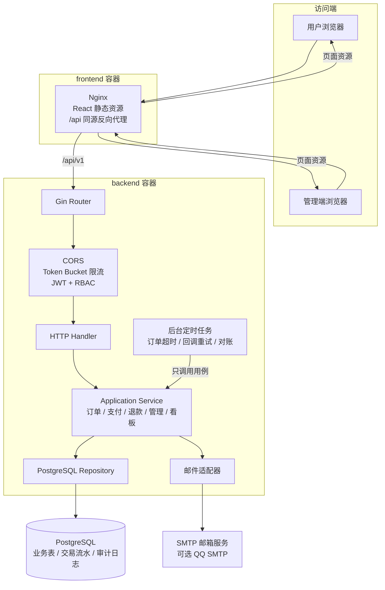
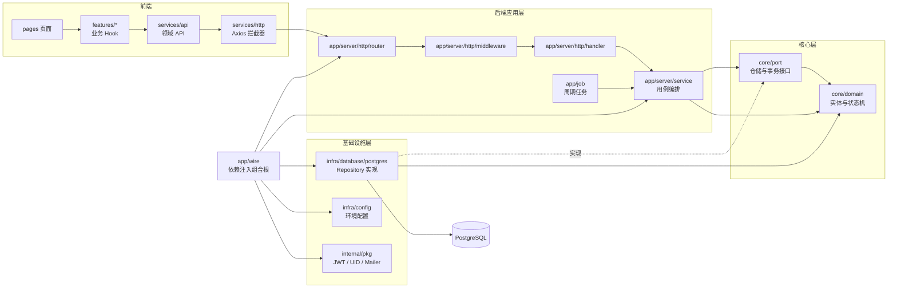
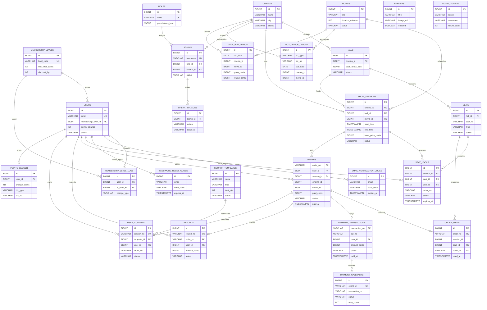
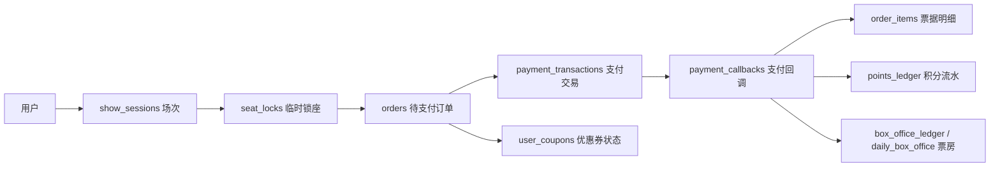
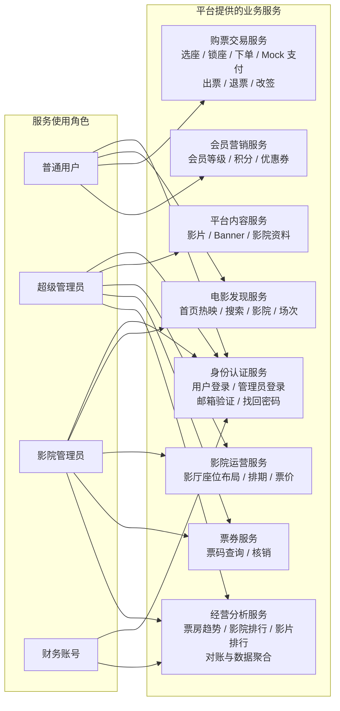

# LTerm 系统架构图

> 版本：v0.1  
> 用途：实验报告、项目答辩和源码导读。图中的组件、角色和数据表均以当前项目实现为准，不额外引入 Kafka、Redis 或 Kubernetes。

## 1. 图表说明

本项目建议使用四张图说明不同问题：

| 图表 | 说明重点 | 适合回答的问题 |
| --- | --- | --- |
| 服务运行架构图 | 系统运行时组件和请求流向 | 浏览器请求如何到达数据库？ |
| 代码依赖关系图 | 前后端代码分层和依赖方向 | 为什么 service 不直接写 SQL？ |
| 数据关系图 | 核心表、外键和业务关联 | 一次购票涉及哪些数据？ |
| 服务提供架构图 | 三类管理角色和用户得到的业务能力 | 每个角色可以使用哪些服务？ |

四张图不要合并成一张。运行架构回答“系统怎么运行”，依赖关系回答“代码怎么组织”，数据关系回答“数据怎么关联”，服务提供架构回答“系统为谁提供什么能力”。

## 2. 服务运行架构图

该图描述 Docker Compose 启动后的实际运行关系。前端容器由 Nginx 提供 React 静态文件，并把 `/api` 请求代理到后端容器；后端通过 PostgreSQL Repository 访问数据库。

### 2.1 运行边界

- `frontend` 和 `backend` 是两个应用容器，`db` 是 PostgreSQL 容器，Compose 负责启动顺序和健康检查。
- `migrate` 容器在后端启动前执行数据库迁移和 Seed；它不是长期运行的业务服务。
- 定时任务和 HTTP 服务运行在同一个 backend 进程中，当前课程版本只启动一个 Worker。
- 支付使用 Mock 支付和 Mock 回调接口，不代表已经接入真实支付平台。
- 邮箱配置 SMTP 后发送真实邮件；未配置 SMTP 时，开发环境返回验证码方便演示。

## 3. 代码依赖关系架构图

该图强调依赖方向。箭头表示“依赖或调用”，虚线表示“接口由适配器实现”。`wire` 是组合根，负责把接口和具体实现装配起来。

### 3.1 依赖规则

1. `handler` 负责绑定参数、调用 service 和映射错误，不直接访问数据库。
2. `service` 依赖 `core/port` 接口和 `core/domain` 规则，不依赖具体 PostgreSQL 类型。
3. `infra/database/postgres` 实现 `core/port`，SQL 和 GORM 细节留在基础设施层。
4. `job` 只调用 service 用例，不绕过状态机直接修改数据。
5. 前端页面只使用业务 Hook；Axios、错误分类、Query Key 和缓存刷新集中在 server 层处理。

## 4. 数据关系架构图

下图是当前数据库的核心 ER 图。带有 `logical` 的关系表示业务关联但没有直接使用数据库外键，例如邮箱验证码通过 `email` 关联用户、票房流水通过业务单号关联支付或退款事件。

### 4.1 一次购票的数据流

核心约束是：订单保存座位和价格快照，支付回调完成出票；座位锁的部分唯一索引防止同一场次同一座位被重复占用；支付回调、积分流水和票房流水通过唯一业务号实现幂等。

## 5. 服务提供架构图

该图从使用者角度描述系统提供的业务能力。它不是代码包依赖图，而是 SaaS 权限和业务服务目录。

### 5.1 SaaS 角色边界

| 角色 | 服务范围 | 数据范围 | 关键限制 |
| --- | --- | --- | --- |
| `USER` | 电影发现、选座购票、支付、退款、改签、积分 | 公开内容和自己的订单 | 不能访问管理接口 |
| `SUPER_ADMIN` | 平台内容、影院运营、账号、票券和全局数据 | 全平台、全部影院 | 关键变更写入审计日志 |
| `CINEMA_ADMIN` | 本影院影厅、座位、排期、票价、核销和看板 | `admins.cinema_id` 绑定影院 | 不能改影片、Banner、优惠券和管理员账号 |
| `FINANCE` | 票房和经营数据查询 | 全局或绑定影院 | 只读，不能排期、改价或核销 |

### 5.2 服务和接口入口

| 业务服务 | 当前接口入口 |
| --- | --- |
| 身份认证 | `/api/v1/auth/*`、`/api/v1/admin/auth/login` |
| 电影发现 | `/api/v1/home`、`/api/v1/movies`、`/api/v1/cinemas`、`/api/v1/sessions` |
| 购票交易 | `/api/v1/orders/*`、`/api/v1/payments/*`、`/api/v1/refunds/*`、`/api/v1/orders/*/change` |
| 平台内容 | `/api/v1/admin/movies`、`/api/v1/admin/banners`、`/api/v1/admin/cinemas` |
| 影院运营 | `/api/v1/admin/halls`、`/api/v1/admin/sessions` |
| 票券核销 | `/api/v1/admin/tickets/verify` |
| 会员营销 | `/api/v1/me/points`、`/api/v1/coupons/redeemable`、`/api/v1/admin/coupons/*` |
| 经营分析 | `/api/v1/admin/dashboard/box-office/*` |

## 6. 报告使用建议

- 系统总体设计章节放“服务运行架构图”。
- 软件结构设计章节放“代码依赖关系架构图”。
- 数据库设计章节放“数据关系架构图”和“一次购票的数据流”。
- 权限设计或系统功能章节放“服务提供架构图”和角色边界表。
- Word 中建议每张图单独编号，例如“图 4-1 LTerm 服务运行架构图”，图下补充 3 到 5 句图解，避免只贴图片没有说明。
