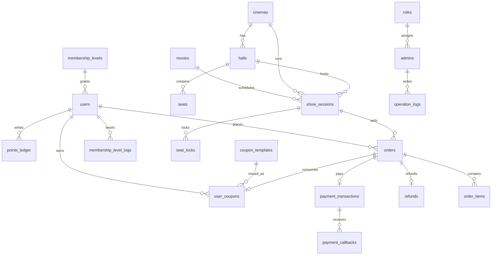

# 数据库表设计（v0.2 草稿 · 待评审）

> 状态：**草稿，留给你评审定稿**。已按你的决策调整：**不做钱包/虚拟货币**，订单直接 Mock 支付直付影院；**积分=赠送值**，支付赠送、退款扣回，不用于购物。
> 学习材料见 [guide/业务建模与贫血DDD.md](../guide/业务建模与贫血DDD.md)，建议你先闭卷设计一遍再对照本表。
> 技术栈：PostgreSQL 15+，Go(Gin)，ORM 或 sqlc 均可按本表建模。

## 0. 设计原则与全局约定

1. **金额一律以「分」为单位的 BIGINT 存储**（`*_cents`），对外接口换算为元，杜绝浮点误差。
2. **折扣以「万分比」INT 存储**（如 9500 = 95 折），避免 DECIMAL 精度问题。
3. **时间统一 `TIMESTAMPTZ`**（存 UTC，展示层转本地）。
4. **主键统一 `BIGSERIAL`**；对外暴露用业务单号（`*_no`，唯一索引）。
5. **状态字段用 `VARCHAR + CHECK` 约束**，状态迁移只允许走服务层状态机，禁止业务代码任意 UPDATE。
6. **流水表只增不改**：`points_ledger`、`payment_callbacks`、`operation_logs` 不做 UPDATE/DELETE。
7. **幂等三件套**：唯一业务号、唯一幂等键、条件 UPDATE。
8. **并发兜底由数据库完成**：部分唯一索引、行锁、乐观锁 `version`、条件更新行数判断。
9. 主数据（用户/影片/影院/管理员）用软删除 `deleted_at`；交易数据不删除。
10. 全部表含 `created_at`、`updated_at`（由 ORM/触发器维护）。

## 1. 账户域：用户 / 会员 / 积分

### 1.1 users 用户表

| 字段 | 类型 | 约束 | 说明 |
| --- | --- | --- | --- |
| id | BIGSERIAL | PK | |
| username | VARCHAR(64) | UNIQUE NOT NULL | 登录名 |
| password_hash | VARCHAR(255) | NOT NULL | bcrypt |
| nickname | VARCHAR(64) | NOT NULL | 昵称 |
| avatar_url | VARCHAR(512) | | 预置头像 URL（不开放上传） |
| phone | VARCHAR(20) | UNIQUE | 手机号，可空 |
| membership_level_id | BIGINT | FK→membership_levels.id | 当前等级（冗余快照） |
| points_balance | INT | NOT NULL DEFAULT 0, CHECK(>=0) | 当前可用积分（= 积分流水求和，冗余快照） |
| total_earned_points | INT | NOT NULL DEFAULT 0 | **累计赠送积分（只增）**，等级升级依据 |
| total_reclaimed_points | INT | NOT NULL DEFAULT 0 | 累计退款扣回积分（监控/报表用） |
| status | VARCHAR(16) | NOT NULL DEFAULT 'ACTIVE', CHECK IN ('ACTIVE','DISABLED') | 账号状态 |
| last_login_at | TIMESTAMPTZ | | |
| created_at / updated_at / deleted_at | TIMESTAMPTZ | | 软删除 |

> 索引：`username`、`phone` 唯一；`(deleted_at, username)` 支持软删除下的唯一。

### 1.2 membership_levels 会员等级表

| 字段 | 类型 | 约束 | 说明 |
| --- | --- | --- | --- |
| id | BIGSERIAL | PK | |
| level_code | VARCHAR(32) | UNIQUE NOT NULL | BRONZE/SILVER/GOLD/DIAMOND |
| name | VARCHAR(32) | NOT NULL | 等级名 |
| min_total_points | INT | NOT NULL CHECK(>=0) | 达到该累计赠送积分即升级 |
| discount_bp | INT | NOT NULL CHECK(BETWEEN 0 AND 10000) | 购票折扣万分比，10000=无折扣 |
| benefits_json | JSONB | DEFAULT '{}' | 扩展权益（优先购/生日券等） |
| sort | INT | NOT NULL | 排序，越大等级越高 |
| status | VARCHAR(16) | NOT NULL DEFAULT 'ACTIVE', CHECK IN ('ACTIVE','INACTIVE') | |
| created_at / updated_at | TIMESTAMPTZ | | |

> 规则：升级只看 `total_earned_points`（累计赠送），退款扣回的是余额，不影响已升级的等级；等级只升不降（课程默认）。

### 1.3 membership_level_logs 等级变更日志

| 字段 | 类型 | 约束 | 说明 |
| --- | --- | --- | --- |
| id | BIGSERIAL | PK | |
| user_id | BIGINT | FK→users.id NOT NULL | |
| from_level_id | BIGINT | FK→membership_levels.id | 可空（首次） |
| to_level_id | BIGINT | FK→membership_levels.id NOT NULL | |
| change_type | VARCHAR(32) | NOT NULL, CHECK IN ('UPGRADE','DOWNGRADE','MANUAL') | 默认只产生 UPGRADE |
| reason | VARCHAR(255) | | |
| operator_id | BIGINT | FK→admins.id | 人工调整时填写 |
| created_at | TIMESTAMPTZ | | |

### 1.4 points_ledger 积分流水表（只增）

| 字段 | 类型 | 约束 | 说明 |
| --- | --- | --- | --- |
| id | BIGSERIAL | PK | |
| user_id | BIGINT | FK→users.id NOT NULL | |
| change_points | INT | NOT NULL | 正=赠送，负=退款扣回 |
| balance_after | INT | NOT NULL | 变动后余额 |
| biz_type | VARCHAR(32) | NOT NULL, CHECK IN ('ORDER_PAID','ORDER_REFUND','MANUAL_ADJUST') | 业务类型 |
| biz_no | VARCHAR(64) | NOT NULL | ORDER_PAID→order_no；ORDER_REFUND→refund_no；MANUAL→adjust_no |
| remark | VARCHAR(255) | | |
| created_at | TIMESTAMPTZ | | |

> **幂等**：`UNIQUE (biz_type, biz_no)` —— 每笔订单赠送一次、每笔退款扣回一次。
> **业务语义**：积分是「赠送值」：支付成功赠送（按规则，如每实付 1 元 = 1 积分）；退款时按退款金额等比例扣回；积分不用于购物，因此没有「消费流水」。

## 2. 支付域：订单直付影院（无钱包）

> 核心思想：用户直接对影院付款，中间**不存在虚拟货币**。支付=创建交易 → Mock 网关 → 回调 → 出票。退款=创建退款单 → Mock 退款 → 回冲。

### 2.1 payment_transactions 支付交易表

| 字段 | 类型 | 约束 | 说明 |
| --- | --- | --- | --- |
| id | BIGSERIAL | PK | |
| transaction_no | VARCHAR(32) | UNIQUE NOT NULL | 交易号，格式 T+时间戳+随机 |
| biz_type | VARCHAR(16) | NOT NULL DEFAULT 'ORDER_PAY', CHECK IN ('ORDER_PAY') | 当前只有订单支付 |
| biz_no | VARCHAR(64) | NOT NULL | order_no |
| user_id | BIGINT | FK→users.id NOT NULL | |
| amount_cents | BIGINT | NOT NULL CHECK(>0) | 实付金额（分） |
| channel | VARCHAR(32) | NOT NULL DEFAULT 'MOCK_PAY', CHECK IN ('MOCK_PAY') | 模拟支付渠道 |
| status | VARCHAR(16) | NOT NULL DEFAULT 'PENDING', CHECK IN ('PENDING','SUCCESS','FAILED','CLOSED','REFUNDED') | 见状态机 |
| external_trade_no | VARCHAR(64) | | 渠道单号 |
| paid_at | TIMESTAMPTZ | | |
| closed_at | TIMESTAMPTZ | | 关闭/失败时间 |
| version | INT | NOT NULL DEFAULT 0 | 乐观锁 |
| created_at / updated_at | TIMESTAMPTZ | | |

> **幂等**：`UNIQUE (biz_type, biz_no)` 保证一单一付；`UNIQUE (channel, external_trade_no)` 防渠道侧重复。

### 2.2 payment_callbacks 支付回调记录表（只增）

| 字段 | 类型 | 约束 | 说明 |
| --- | --- | --- | --- |
| id | BIGSERIAL | PK | |
| event_id | VARCHAR(64) | UNIQUE NOT NULL | **幂等键**（网关事件 ID） |
| transaction_no | VARCHAR(32) | FK→payment_transactions.transaction_no | |
| biz_type / biz_no | VARCHAR | NOT NULL | 冗余便于对账 |
| channel | VARCHAR(32) | NOT NULL | |
| payload | JSONB | NOT NULL | 原始报文留痕 |
| status | VARCHAR(16) | NOT NULL, CHECK IN ('RECEIVED','VERIFIED','PROCESSED','DUPLICATE','FAILED') | 处理状态 |
| process_result | VARCHAR(512) | | 失败原因 |
| retry_count | INT | NOT NULL DEFAULT 0 | 重试次数 |
| processed_at | TIMESTAMPTZ | | |
| created_at | TIMESTAMPTZ | | |

### 2.3 refunds 退款单表

| 字段 | 类型 | 约束 | 说明 |
| --- | --- | --- | --- |
| id | BIGSERIAL | PK | |
| refund_no | VARCHAR(32) | UNIQUE NOT NULL | 退款单号，格式 RF+时间戳+随机 |
| order_id | BIGINT | FK→orders.id NOT NULL, UNIQUE | 课程默认整单退款，一单一退 |
| user_id | BIGINT | FK→users.id NOT NULL | |
| amount_cents | BIGINT | NOT NULL CHECK(>0) | 退款金额 = 订单实付 |
| reason | VARCHAR(255) | | 用户/管理员填写的退款原因 |
| status | VARCHAR(16) | NOT NULL DEFAULT 'PENDING', CHECK IN ('PENDING','SUCCESS','FAILED') | 见状态机 |
| external_refund_no | VARCHAR(64) | UNIQUE | Mock 渠道退款单号 |
| refunded_at | TIMESTAMPTZ | | |
| created_at / updated_at | TIMESTAMPTZ | | |

> 退款联动（同一事务）：订单 PAID→REFUNDED、支付交易 SUCCESS→REFUNDED、座位锁 BOOKED→RELEASED、积分扣回（负流水）、票房净额扣减、优惠券不返还（默认）。

## 3. 票务域：影片 / 影院 / 场次 / 座位 / 订单

### 3.1 movies 影片表

| 字段 | 类型 | 约束 | 说明 |
| --- | --- | --- | --- |
| id | BIGSERIAL | PK | |
| title | VARCHAR(128) | NOT NULL | |
| cover_url | VARCHAR(512) | NOT NULL | 静态资源 URL（不买 COS） |
| trailer_url | VARCHAR(512) | | 预告片 URL，可空 |
| description | TEXT | | |
| duration_minutes | INT | CHECK(>0) | 时长 |
| genre | VARCHAR(64) | | 类型 |
| release_date | DATE | | 上映日期 |
| rating | NUMERIC(3,1) | CHECK(BETWEEN 0 AND 10) | 评分，可空 |
| status | VARCHAR(16) | NOT NULL DEFAULT 'ON_SALE', CHECK IN ('ON_SALE','OFF_SALE') | |
| created_at / updated_at / deleted_at | TIMESTAMPTZ | | |

### 3.2 cinemas 影院表

| 字段 | 类型 | 约束 | 说明 |
| --- | --- | --- | --- |
| id | BIGSERIAL | PK | |
| name | VARCHAR(128) | NOT NULL | |
| city | VARCHAR(64) | NOT NULL | 城市 |
| address | VARCHAR(255) | NOT NULL | |
| longitude / latitude | DOUBLE PRECISION | | 附近推荐用距离计算 |
| status | VARCHAR(16) | NOT NULL DEFAULT 'ACTIVE', CHECK IN ('ACTIVE','INACTIVE') | |
| created_at / updated_at / deleted_at | TIMESTAMPTZ | | |

> 附近推荐：数据量小用 `(lat-lat0)^2+(lon-lon0)^2` 排序；后续量大可上 PostGIS。

### 3.3 halls 影厅表

| 字段 | 类型 | 约束 | 说明 |
| --- | --- | --- | --- |
| id | BIGSERIAL | PK | |
| cinema_id | BIGINT | FK→cinemas.id NOT NULL | |
| name | VARCHAR(64) | NOT NULL | 1号厅/IMAX厅 |
| seat_layout_json | JSONB | NOT NULL | 座位布局元数据（排/列/类型坐标），前端渲染用 |
| status | VARCHAR(16) | NOT NULL DEFAULT 'ACTIVE', CHECK IN ('ACTIVE','MAINTENANCE') | |
| created_at / updated_at | TIMESTAMPTZ | | |

### 3.4 seats 座位表

| 字段 | 类型 | 约束 | 说明 |
| --- | --- | --- | --- |
| id | BIGSERIAL | PK | |
| hall_id | BIGINT | FK→halls.id NOT NULL | |
| row_no | INT | NOT NULL | 排 |
| col_no | INT | NOT NULL | 列 |
| seat_no | VARCHAR(16) | NOT NULL | 如 A12 |
| type | VARCHAR(16) | NOT NULL DEFAULT 'STANDARD', CHECK IN ('STANDARD','VIP','LOUNGE') | 座位类型（对应票价） |
| status | VARCHAR(16) | NOT NULL DEFAULT 'ENABLED', CHECK IN ('ENABLED','DISABLED') | 物理可用性 |
| created_at / updated_at | TIMESTAMPTZ | | |

> `UNIQUE (hall_id, row_no, col_no)`。

### 3.5 show_sessions 场次表

| 字段 | 类型 | 约束 | 说明 |
| --- | --- | --- | --- |
| id | BIGSERIAL | PK | |
| cinema_id | BIGINT | FK→cinemas.id NOT NULL | 冗余便于查影院场次 |
| hall_id | BIGINT | FK→halls.id NOT NULL | |
| movie_id | BIGINT | FK→movies.id NOT NULL | |
| start_time | TIMESTAMPTZ | NOT NULL | |
| end_time | TIMESTAMPTZ | NOT NULL, CHECK(end_time > start_time) | |
| base_price_cents | BIGINT | NOT NULL CHECK(>0) | 基础票价（分） |
| price_rules_json | JSONB | DEFAULT '{}' | 座位类型覆盖价，如 {"VIP": 16000} |
| status | VARCHAR(16) | NOT NULL DEFAULT 'OPEN', CHECK IN ('OPEN','SOLD_OUT','CLOSED','CANCELED') | |
| created_at / updated_at | TIMESTAMPTZ | | |

> 索引：`(movie_id, start_time)`、`(cinema_id, start_time)`、`(start_time)`；同影厅时间冲突由应用层校验（必要时加排他约束）。

### 3.6 seat_locks 座位锁表

| 字段 | 类型 | 约束 | 说明 |
| --- | --- | --- | --- |
| id | BIGSERIAL | PK | |
| session_id | BIGINT | FK→show_sessions.id NOT NULL | |
| seat_id | BIGINT | FK→seats.id NOT NULL | |
| user_id | BIGINT | FK→users.id NOT NULL | |
| order_id | BIGINT | FK→orders.id | 下单后关联，可空 |
| lock_token | UUID | NOT NULL DEFAULT gen_random_uuid() | 锁令牌，解锁/续锁校验 |
| status | VARCHAR(16) | NOT NULL DEFAULT 'LOCKED', CHECK IN ('LOCKED','BOOKED','RELEASED','EXPIRED') | |
| expires_at | TIMESTAMPTZ | NOT NULL | 默认 now()+15min |
| released_at | TIMESTAMPTZ | | |
| created_at / updated_at | TIMESTAMPTZ | | |

> **防超卖核心**：
> `CREATE UNIQUE INDEX uq_seat_locks_active ON seat_locks(session_id, seat_id) WHERE status IN ('LOCKED','BOOKED');`
> 两个用户并发锁同一座位时，数据库唯一冲突保证只有一个成功；锁释放仅作 UPDATE 状态（索引随之让位）。

### 3.7 orders 订单表

| 字段 | 类型 | 约束 | 说明 |
| --- | --- | --- | --- |
| id | BIGSERIAL | PK | |
| order_no | VARCHAR(32) | UNIQUE NOT NULL | 格式 O+时间戳+随机 |
| user_id | BIGINT | FK→users.id NOT NULL | |
| session_id | BIGINT | FK→show_sessions.id NOT NULL | |
| cinema_id / movie_id | BIGINT | FK, NOT NULL | 冗余便于查询/统计 |
| total_cents | BIGINT | NOT NULL CHECK(>=0) | 票面合计 |
| discount_cents | BIGINT | NOT NULL DEFAULT 0 | 会员折扣+活动优惠合计 |
| coupon_cents | BIGINT | NOT NULL DEFAULT 0 | 优惠券抵扣 |
| paid_cents | BIGINT | NOT NULL CHECK(>=0) | 实付 = total - discount - coupon |
| coupon_instance_id | BIGINT | FK→user_coupons.id | 使用券实例，可空 |
| status | VARCHAR(24) | NOT NULL DEFAULT 'PENDING_PAYMENT', CHECK IN ('PENDING_PAYMENT','PAID','COMPLETED','CANCELED','EXPIRED','REFUNDING','REFUNDED') | |
| cancel_reason | VARCHAR(16) | CHECK IN ('USER','EXPIRED','ADMIN') | 取消原因 |
| expire_at | TIMESTAMPTZ | NOT NULL | 支付截止，默认 15min |
| paid_at / completed_at / canceled_at / expired_at | TIMESTAMPTZ | | |
| version | INT | NOT NULL DEFAULT 0 | 乐观锁 |
| created_at / updated_at | TIMESTAMPTZ | | |

> 索引：`(user_id, created_at DESC)`、`(session_id)`、`(status)`、`(order_no)`。

### 3.8 order_items 订单明细表（票）

| 字段 | 类型 | 约束 | 说明 |
| --- | --- | --- | --- |
| id | BIGSERIAL | PK | |
| order_id | BIGINT | FK→orders.id NOT NULL | |
| session_id / seat_id | BIGINT | FK NOT NULL | |
| seat_no | VARCHAR(16) | NOT NULL | 冗余 |
| price_cents | BIGINT | NOT NULL CHECK(>0) | 该座成交价 |
| ticket_no | VARCHAR(32) | UNIQUE | 支付成功生成取票码 |
| used_at | TIMESTAMPTZ | | 观影核销时间 |
| refunded_at | TIMESTAMPTZ | | 退款时间 |
| created_at | TIMESTAMPTZ | | |

## 4. 营销域：优惠券

### 4.1 coupon_templates 优惠券模板表

| 字段 | 类型 | 约束 | 说明 |
| --- | --- | --- | --- |
| id | BIGSERIAL | PK | |
| name | VARCHAR(64) | NOT NULL | 券名 |
| type | VARCHAR(16) | NOT NULL, CHECK IN ('FIXED','PERCENT') | 满减 / 折扣 |
| value_cents | BIGINT | CHECK(>0) | FIXED 面额（分） |
| percent_bp | INT | CHECK(BETWEEN 0 AND 10000) | PERCENT 折扣万分比（9000=9折） |
| min_spend_cents | BIGINT | NOT NULL DEFAULT 0 CHECK(>=0) | 使用门槛 |
| max_discount_cents | BIGINT | CHECK(>=0) | 折扣券封顶，可空 |
| total_qty | INT | NOT NULL CHECK(>=0) | 发行总量 |
| issued_qty | INT | NOT NULL DEFAULT 0 CHECK(issued_qty <= total_qty) | 已发放量 |
| per_user_limit | INT | NOT NULL DEFAULT 1 | 每人限领 |
| valid_from / valid_until | TIMESTAMPTZ | NOT NULL | 有效期 |
| status | VARCHAR(16) | NOT NULL DEFAULT 'DRAFT', CHECK IN ('DRAFT','ACTIVE','PAUSED','EXPIRED') | |
| created_at / updated_at | TIMESTAMPTZ | | |

> **防超发**：发放时执行 `UPDATE coupon_templates SET issued_qty = issued_qty + 1 WHERE id=? AND issued_qty < total_qty`，影响行数 = 1 才成功。

### 4.2 user_coupons 用户优惠券表（券实例）

| 字段 | 类型 | 约束 | 说明 |
| --- | --- | --- | --- |
| id | BIGSERIAL | PK | |
| coupon_no | VARCHAR(32) | UNIQUE NOT NULL | 券号，格式 C+随机 |
| template_id | BIGINT | FK→coupon_templates.id NOT NULL | |
| user_id | BIGINT | FK→users.id NOT NULL | |
| status | VARCHAR(16) | NOT NULL DEFAULT 'UNUSED', CHECK IN ('UNUSED','LOCKED','USED','EXPIRED') | |
| order_id | BIGINT | FK→orders.id | 锁定/核销的订单 |
| expire_at | TIMESTAMPTZ | NOT NULL | 实例有效期（≤模板） |
| used_at | TIMESTAMPTZ | | |
| created_at / updated_at | TIMESTAMPTZ | | |

> **原子核销**：`UPDATE user_coupons SET status='USED', order_id=?, used_at=now() WHERE id=? AND status='UNUSED'`，影响行数 = 1 才允许继续支付；下单时先 LOCKED，取消回 UNUSED。
> 索引：`(user_id, status)`、`(status, expire_at)`。

## 5. 管理域：管理员 / 角色 / 审计

### 5.1 admins 管理员表

| 字段 | 类型 | 约束 | 说明 |
| --- | --- | --- | --- |
| id | BIGSERIAL | PK | |
| username | VARCHAR(64) | UNIQUE NOT NULL | |
| password_hash | VARCHAR(255) | NOT NULL | bcrypt |
| nickname | VARCHAR(64) | NOT NULL | |
| avatar_url | VARCHAR(512) | | 预置头像 |
| role_id | BIGINT | FK→roles.id NOT NULL | |
| status | VARCHAR(16) | NOT NULL DEFAULT 'ACTIVE', CHECK IN ('ACTIVE','DISABLED') | |
| last_login_at | TIMESTAMPTZ | | |
| created_at / updated_at / deleted_at | TIMESTAMPTZ | | |

### 5.2 roles 角色表

| 字段 | 类型 | 约束 | 说明 |
| --- | --- | --- | --- |
| id | BIGSERIAL | PK | |
| code | VARCHAR(32) | UNIQUE NOT NULL | SUPER_ADMIN / OPERATOR / FINANCE |
| name | VARCHAR(32) | NOT NULL | |
| permissions_json | JSONB | NOT NULL DEFAULT '[]' | 权限点数组（课程级 RBAC） |
| status | VARCHAR(16) | NOT NULL DEFAULT 'ACTIVE', CHECK IN ('ACTIVE','INACTIVE') | |
| created_at / updated_at | TIMESTAMPTZ | | |

### 5.3 operation_logs 操作审计日志表（只增）

| 字段 | 类型 | 约束 | 说明 |
| --- | --- | --- | --- |
| id | BIGSERIAL | PK | |
| admin_id | BIGINT | FK→admins.id NOT NULL | |
| action | VARCHAR(64) | NOT NULL | 如 CHANGE_PRICE / ISSUE_COUPON |
| target_type / target_id | VARCHAR(64) | NOT NULL | 对象类型与 ID |
| detail_json | JSONB | DEFAULT '{}' | 变更前后值 |
| ip | VARCHAR(45) | | |
| created_at | TIMESTAMPTZ | | |

## 6. 数据大盘

### 6.1 daily_box_office 日票房聚合表

| 字段 | 类型 | 约束 | 说明 |
| --- | --- | --- | --- |
| id | BIGSERIAL | PK | |
| stat_date | DATE | NOT NULL | 统计日（UTC+8 自然日） |
| cinema_id | BIGINT | FK NOT NULL | |
| movie_id | BIGINT | FK NOT NULL | |
| order_count | INT | NOT NULL DEFAULT 0 | 支付订单数 |
| ticket_count | INT | NOT NULL DEFAULT 0 | 出票数 |
| gross_cents | BIGINT | NOT NULL DEFAULT 0 | 票款总额 |
| refund_cents | BIGINT | NOT NULL DEFAULT 0 | 退款额 |
| net_cents | BIGINT | NOT NULL DEFAULT 0 | 净额 = gross - refund |
| updated_at | TIMESTAMPTZ | | |

> `UNIQUE (stat_date, cinema_id, movie_id)`；支付成功/退款成功事务内 UPSERT，避免大盘实时扫描订单表打爆数据库。

## 7. 核心表关系（ER）



## 8. 关键实现要点（给开发的锚点）

### 8.1 支付回调出票（单事务）

```sql
BEGIN;
-- 1. 幂等检查：回调 event_id 已存在则直接返回
INSERT INTO payment_callbacks(event_id, transaction_no, biz_type, biz_no, payload, status)
VALUES ($1, $2, 'ORDER_PAY', $3, $4, 'RECEIVED');

-- 2. 订单 PENDING_PAYMENT -> PAID（校验金额/状态）
UPDATE orders SET status='PAID', paid_at=now(), version=version+1
WHERE order_no=$3 AND status='PENDING_PAYMENT' AND paid_cents=$5;

-- 3. 交易流水 PENDING -> SUCCESS
UPDATE payment_transactions SET status='SUCCESS', paid_at=now()
WHERE transaction_no=$2 AND status='PENDING';

-- 4. 锁座 LOCKED -> BOOKED
UPDATE seat_locks SET status='BOOKED' WHERE order_id=$6 AND status='LOCKED';

-- 5. 生成取票码（每张票）
UPDATE order_items SET ticket_no=$7 WHERE order_id=$6 AND ticket_no IS NULL;

-- 6. 优惠券 LOCKED -> USED
UPDATE user_coupons SET status='USED', used_at=now() WHERE order_id=$6 AND status='LOCKED';

-- 7. 积分赠送（幂等：biz_type+biz_no 唯一）
INSERT INTO points_ledger(user_id, change_points, balance_after, biz_type, biz_no)
VALUES ($8, $9, $10, 'ORDER_PAID', $3);
UPDATE users SET points_balance=$10, total_earned_points=total_earned_points+$9
WHERE id=$8;

-- 8. 票房 upsert
INSERT INTO daily_box_office(stat_date, cinema_id, movie_id, order_count, ticket_count, gross_cents)
VALUES ($11, $12, $13, 1, $14, $5)
ON CONFLICT (stat_date, cinema_id, movie_id)
DO UPDATE SET order_count=order_count+1, ticket_count=ticket_count+$14, gross_cents=gross_cents+$5;

-- 9. 回调标记 PROCESSED
UPDATE payment_callbacks SET status='PROCESSED', processed_at=now() WHERE event_id=$1;
COMMIT;
```

> 任一步失败整体回滚；若事务中途宕机，对账任务扫描「订单 PAID 但交易/锁/积分不一致」的记录补齐，幂等键保证不重复。

### 8.2 退款回冲（单事务）

```sql
BEGIN;
-- 1. 退款单 PENDING -> SUCCESS
UPDATE refunds SET status='SUCCESS', refunded_at=now()
WHERE refund_no=$1 AND status='PENDING';

-- 2. 订单 PAID -> REFUNDED
UPDATE orders SET status='REFUNDED', version=version+1
WHERE order_no=$2 AND status='PAID';

-- 3. 支付交易 SUCCESS -> REFUNDED
UPDATE payment_transactions SET status='REFUNDED'
WHERE biz_type='ORDER_PAY' AND biz_no=$2 AND status='SUCCESS';

-- 4. 座位释放
UPDATE seat_locks SET status='RELEASED', released_at=now()
WHERE order_id=$3 AND status='BOOKED';

-- 5. 积分扣回（幂等：ORDER_REFUND + refund_no）
INSERT INTO points_ledger(user_id, change_points, balance_after, biz_type, biz_no)
VALUES ($4, -$5, $6, 'ORDER_REFUND', $1);
UPDATE users SET points_balance=$6, total_reclaimed_points=total_reclaimed_points+$5
WHERE id=$4;

-- 6. 票房扣净额
UPDATE daily_box_office SET refund_cents=refund_cents+$7, net_cents=net_cents-$7
WHERE stat_date=$8 AND cinema_id=$9 AND movie_id=$10;
COMMIT;
```

### 8.3 锁座（并发不超卖）

```sql
BEGIN;
-- 部分唯一索引兜底，冲突即锁座失败
INSERT INTO seat_locks(session_id, seat_id, user_id, order_id, lock_token, status, expires_at)
VALUES ($1, $2, $3, NULL, gen_random_uuid(), 'LOCKED', now() + interval '15 minutes');
COMMIT;
```

### 8.4 优惠券核销（原子抢占）

```sql
UPDATE user_coupons SET status='LOCKED', order_id=$1
WHERE id=$2 AND status='UNUSED';
-- 影响行数 = 1 才允许继续；订单取消时回滚为 UNUSED
```

## 9. 评审清单（你确认后我继续优化）

- [ ] 积分赠送规则是否按「每实付 1 元 = 1 积分」（可配置）
- [ ] 退款扣回积分是否按「退款金额等比例扣回」
- [ ] 订单是否支持整单退款（默认开场前）
- [ ] 会员等级是否只升不降（默认是）
- [ ] 状态枚举是否需要增加细分（如支付中 PROCESSING）
- [ ] 你闭卷设计的表与本文差异点（建议记录到 guide 文档对照表）
