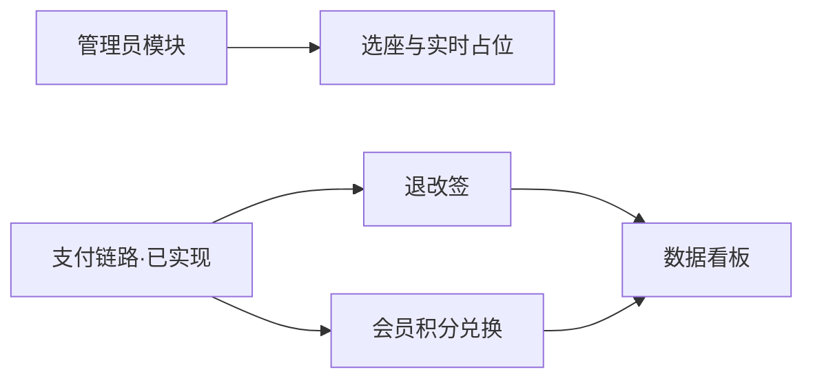

# 设计总览：剩余五模块

> 状态：v0.1 设计稿，待评审。
> 前提：主链路（下单 → 支付 → 回调出票）已实现，本设计只覆盖剩余业务模块，不回头改主链路结构。

## 1. 模块与优先级

| 优先级 | 模块 | 依赖 | 说明 |
| --- | --- | --- | --- |
| P1 | 管理员模块 | 无 | 数据入口：影片/影厅/场次/票价，否则选座无数据 |
| P1 | 选座与实时占位 | 管理员模块 | 后端查询 + 前端可视化 |
| P2 | 订单退改签 | 支付链路 | 退款/改签闭环 |
| P3 | 会员积分兑换 | 支付链路 | 赠送/扣回/兑换/等级 |
| P3 | 数据看板 | 支付链路 + 退改签 | 聚合与大盘，重点是口径与幂等 |

## 2. 模块依赖

## 3. 统一约定（所有新模块遵守）

1. 金额一律「分」BIGINT；时间 TIMESTAMPTZ；状态 VARCHAR + CHECK。
2. 幂等：业务单号唯一 + 流水唯一键 `(biz_type, biz_no)`。
3. 一个用例一个事务，事务由 service 经 TxManager 启动，repo 只收 ctx。
4. 新表放 `sql/migrations/migrations002.sql`，旧表只允许 ADD COLUMN。
5. 领域错误进 `core/domain/errors.go`，HTTP 映射进 `http/resp`，组装进 `wire`。
6. 管理端接口需 RBAC：SUPER_ADMIN / CINEMA_ADMIN / FINANCE；关键操作写 `operation_logs`。

## 4. 待拍板决策

## 5. 已确认决策（2026-08-29）

| 决策 | 结论 |
| --- | --- |
| 改签范围 | 仅同影片跨场次，禁止跨影片 |
| 改签差价手续费 | 0，多退少补 |
| 积分兑换 | 券与物品都支持（看运营配置）；兑换模板可配 |
| 看板权限 | SUPER_ADMIN 看全部；影院管理员看自己影院 |
| 鉴权 | 用户端 + 管理端都做 JWT |
