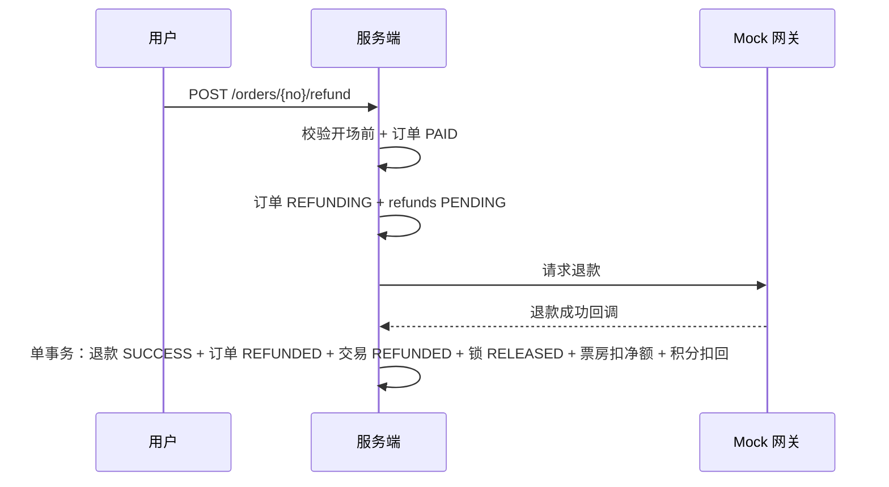

# 03 订单退改签设计（v0.1）

## 1. 范围

开场前整单退款；同影片跨场次改签（退旧单 + 订新单，差价多退少补）。

## 2. 数据模型

新增表（migrations002）：`refunds`。

| 字段 | 说明 |
| --- | --- |
| refund_no | 退款单号，唯一 |
| order_id / user_id | 关联 |
| amount_cents | = 订单实付 |
| reason | 原因 |
| status | PENDING / SUCCESS / FAILED |
| external_refund_no | Mock 渠道退款单号，唯一 |
| refunded_at | 完成时间 |

> `UNIQUE(order_id)`：一单一退；`UNIQUE(refund_no)`、`UNIQUE(external_refund_no)` 幂等。

## 3. 退款流程

## 4. 改签流程（退旧 + 订新，原子两步）

1. 校验原单 PAID、开场前、目标场次可购；
2. **先锁新座并创建新单**（复用 CreateOrder，锁成功才继续）；
3. 再对原单执行退款（同一用例内两个事务边界：新单成功 → 原单退款；退款失败则新单取消释放，保证不两头空）；
4. 差价规则：原实付 > 新实付 → 退差额；原实付 < 新实付 → 用户补差额（走 Mock 支付）。

## 5. 接口

| 方法 | 路径 | 说明 |
| --- | --- | --- |
| POST | /api/v1/orders/{order_no}/refund | 申请整单退款 |
| POST | /api/v1/orders/{order_no}/change | 改签：{new_session_id, new_seat_ids} |
| POST | /api/v1/refunds/mock-callback | Mock 退款回调（幂等 event_id） |
| GET | /api/v1/orders/{order_no}/refunds | 退款进度 |

## 6. 边界与异常

- 已开场/已完成：409 拒绝退款。
- 退款中重复请求：返回已有退款单（幂等）。
- 退款失败：订单回到 PAID，用户可重试。
- 优惠券退款后默认不返还（模板可配）。
- 改签目标场次锁座失败：整个用例回滚，原单不受影响。
