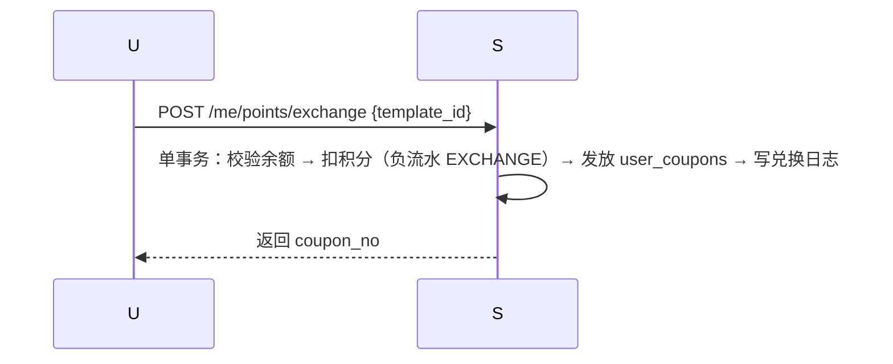

# 04 会员积分兑换设计（v0.1）

## 1. 规则总览

积分 = 赠送值：支付赠送、退款按比例扣回、可兑换优惠券；**不可当钱花**。
等级只看「累计赠送积分」（只增），兑换/扣回不降级。

## 2. 数据模型（migrations002）

| 表 | 关键字段 | 说明 |
| --- | --- | --- |
| points_ledger | user_id、change_points、balance_after、biz_type、biz_no | 只增；UNIQUE(biz_type,biz_no) |
| membership_levels | level_code、min_total_points、discount_bp | 等级规则 |
| membership_level_logs | from/to_level、change_type | 升级记录 |

`users` 增加：`points_balance`（已有）、`total_earned_points`（已有）、`total_reclaimed_points`（已有）。

## 3. 业务规则

### 3.1 赠送（支付成功事务内）

- 规则：每实付 1 元 = 1 积分（可配置）。
- 幂等：`points_ledger UNIQUE(biz_type='ORDER_PAID', biz_no=order_no)`。

### 3.2 扣回（退款成功事务内）

- 按退款金额等比例扣回积分。
- 幂等：`UNIQUE(biz_type='ORDER_REFUND', biz_no=refund_no)`。
- 扣回不触发降级。

### 3.3 兑换（积分 → 优惠券）

决策（已确认）：**兑换券与兑换物品都支持**，由兑换目录配置决定：

| 兑换类型 | 说明 | 本期 |
| --- | --- | --- |
| COUPON | 积分 → 优惠券实例（模板标记 redeemable） | 实现 |
| ITEM | 积分 → 虚拟物品（如周边兑换码），预留 exchange_products 表 | 预留 |

- 兑换幂等：exchange_no 唯一；`points_ledger UNIQUE('EXCHANGE', exchange_no)`。
- 兑换模板需标记 `redeemable=true`（coupon_templates 增加列）。
- 兑换比例示例：1000 分 = 10 元满减券（模板可配）。

### 3.4 等级（支付成功事务内）

- 支付后按 `total_earned_points` 查最高可升级别，变化写 `membership_level_logs` + 更新 users。
- 折扣 `discount_bp` 在**订单创建时**快照（本期仍固定 10000，接入时改 biz）。

## 4. 接口

| 方法 | 路径 | 说明 |
| --- | --- | --- |
| GET | /api/v1/me/points | 积分余额 + 流水 |
| GET | /api/v1/me/membership | 当前等级/下一级/进度 |
| GET | /api/v1/coupons/redeemable | 可兑换模板 |
| POST | /api/v1/me/points/exchange | 兑换（{template_id}） |

## 5. 防膨胀清单

- 等级只看累计赠送，不看余额；
- 兑换只扣 balance，不影响等级；
- 退款扣回 balance，不降级；
- 所有积分变动必须走 points_ledger，禁止直接改 users.points_balance。
