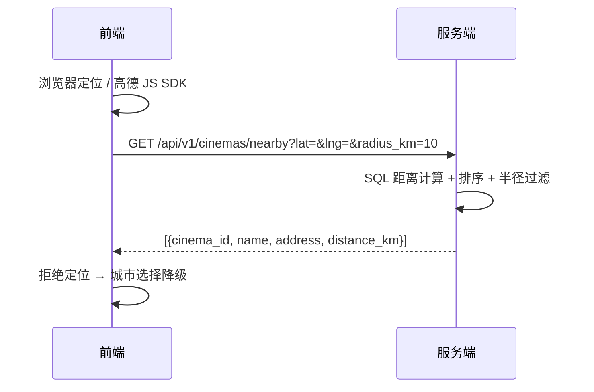

# 06 首页推荐与内容资源设计（v0.1）

## 1. 范围

首页电影推荐、预告片/海报资源策略（不买存储桶）、头像策略（颜色头像）、按定位推荐附近影院。

## 2. 首页电影推荐

### 2.1 推荐规则（课程级）

热度分 = 售票数 × 0.7 + 评分 × 10 + 上映时间衰减（越新越高），`status = ON_SALE` 且已上映。

- 数据源：`movies` + 已支付订单按 movie_id 聚合售票数（数据量小时 SQL 直接算，后续换 daily_box_office）。
- 首页展示：顶部轮播 banner（3~5 部） + 热映横滑列表。

### 2.2 接口

`GET /api/v1/home` →

```json
{
  "banners": [ { "movie_id": 9, "title": "沙丘3", "cover_url": "https://..." } ],
  "hot_movies": [ { "movie_id": 9, "title": "沙丘3", "cover_url": "...", "trailer_url": "...", "rating": 8.8, "sold_count": 120 } ]
}
```

## 3. 视频与图片资源：只存 URL，不建存储桶

### 3.1 原则

`cover_url`、`trailer_url`、`avatar_url` 全部是**外部 URL 引用**，数据库只存地址，不落文件。

### 3.2 视频源建议

| 方案 | 优点 | 注意 |
| --- | --- | --- |
| bilibili iframe（`player.bilibili.com/player.html?bvid=...`） | 无需自建存储、播放器现成 | 需要外链播放权限；无法直接拿文件流 |
| 直链 mp4 URL | 可控性强 | 跨域/防盗链；课程素材难找 |
| 前端静态资源（前端仓库 public/ 放 mp4） | 完全自控、离线可演示、与前端同源无跨域 | 打包体积大；视频更新要重新发前端 |

决策（已确认）：**bilibili iframe 与「前端存视频」双方案都保留**——课程演示优先前端静态 mp4（离线可跑、无跨域），接入真实内容时换 bilibili iframe；后端依旧只存 URL，不落文件。

### 3.3 自动播放策略

**不做首页自动播放**。浏览器普遍拦截「有声自动播放」，且伤流量。设计：

- 列表页：海报静态展示；
- 详情页/弹窗：用户点击后播放预告片；
- 可选增强：鼠标悬停静音预览（muted autoplay 浏览器允许），本期不做。

### 3.4 URL 校验

后台保存 URL 时校验：`https` + 白名单域名（bilibili.com、自选图床），防外链劫持。

## 4. 头像策略：颜色头像

同意「头像不重要」：**默认不存图片**。

- 方案：`username` 哈希 → HSL 色相 → 前端 CSS 生成纯色/渐变圆形头像，首字母居中。
- `users.avatar_url` 保留为**可选覆盖**（预置头像），可空；无上传接口。
- 无需头像存储、无需图片鉴黄等成本。

## 5. 按定位推荐附近影院

### 5.1 难度评估

**不难**，属于「课程级半天到一天」的活：

- `cinemas` 表已有 `longitude/latitude`；
- 影院数量小（个位数~几十家），SQL 全量算距离排序即可；
- 不需要 PostGIS、不需要 geohash（那是万级数据才需要的优化）。

### 5.2 距离公式

课程级用简化等距圆柱近似（误差可接受）：

```
distance_km = sqrt( (Δlat * 111)^2 + (Δlon * 111 * cos(lat0))^2 )
```

需要更准再上 Haversine；两者都是一条 SQL。

### 5.3 流程与接口



### 5.4 没有 GPS 时怎么定位

**后端不负责判定位置，只收坐标**。定位链路全部在前端：

| 层级 | 方案 | 精度 | 说明 |
| --- | --- | --- | --- |
| 1. 浏览器定位 | `navigator.geolocation`（Geolocation API） | 米级~百米级 | 手机用 GPS/基站；**电脑没有 GPS 芯片也能用 WiFi/IP 定位**；需要 HTTPS 或 localhost |
| 2. 手动选点 | 城市/地标选择，或地图点选/输入坐标 | 用户自定 | 演示与无定位环境的主力方案 |
| 3. IP 定位（后端） | 请求 IP → 免费 IP 库 | 城市级 | 只适合城市降级，不适合影院级距离 |

接口带上 `location_source` 说明来源：

`GET /api/v1/cinemas/nearby?lat=&lng=&location_source=gps|wifi|manual|city`

课程演示建议提供「模拟定位」入口（下拉选城市/地标），保证没 GPS 也能跑通附近影院。

决策（已确认）：**浏览器 Geolocation（1）+ 手动选点/模拟定位（2）都做**；IP 定位（3）仅作可选降级，本期可不实现。

### 5.5 降级策略

- 定位权限拒绝：城市列表 → 该城市影院；
- 定位超时：同城市降级；
- 无匹配：空态引导搜索。

## 6. 验收标准

- Given 已上映影片，When 打开首页，Then 按热度倒序展示；
- Given 点击预告片，When 播放，Then 使用外部 iframe，不经过自建存储；
- Given 用户无头像，When 展示，Then 按用户名生成颜色头像；
- Given 前端传经纬度，When 请求附近影院，Then 按距离升序返回且带 distance_km；
- Given 拒绝定位，When 请求，Then 降级为城市影院列表。
