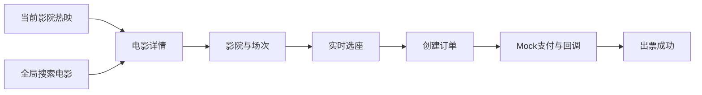
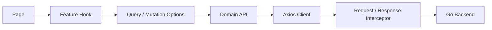

# 07 前端 UIUX 与架构设计（v0.3）

> 状态：已确认基线，前端首版已按本设计实现，待真实素材与接口联调评审。
> 目标：在不改变后端领域边界的前提下，建立胶片灰/影院红用户端、深灰管理端、分层 Router、统一 Axios 与 Server Hook 体系。系统按 SaaS 模型区分平台权限与影院租户权限。

## 1. 产品定位

LTerm 前端由两套工作空间组成：

1. **用户端**：当前影院热映 + 全局电影搜索 + 场次/座位/订单闭环。
2. **管理端**：票房数据与影院运营控制台。

用户端的主上下文是「当前影院」，但搜索必须是全局入口。影院是场次过滤条件，不限制用户搜索电影。



## 2. UIUX 基线

### 2.1 用户端：胶片灰与影院红

- 页面背景使用胶片灰，内容使用白色表面，整体信息密度参考电影资料站。
- 影院红只用于主操作、评分强调、选中态和关键金额，不做大面积铺底。
- 首页使用一个电影大屏 Hero 承担氛围，正文保留热映海报墙和场次信息。
- 首页默认展示当前影院的「正在上映」电影。
- 顶部保留一个全局搜索框，支持电影、类型、影院关键词。
- 影院切换和搜索结果都可以改变场次范围。

### 2.2 管理端：深灰控制台

- 使用深灰背景、灰色表面和克制金色。
- 左侧导航固定，菜单与路由使用同一份权限注册表。
- 看板采用指标卡、趋势图、排行和筛选器。
- CRUD 页面使用列表 + Drawer 表单，不为每个操作新增独立层级。

### 2.3 首页版式

首页不再堆叠多个同级模块，信息层级固定为：

```text
顶部导航
└── 全局搜索 / 热映 / 推荐 / 影院 / 账户

当前影院上下文
└── 当前影院、日期、切换影院

电影分类
└── 全部 / 科幻 / 动画 / 悬疑 / 剧情 / 动作 / 喜剧

电影 Hero
└── 横向背景 + 主海报 + 标题/评分/简介/CTA + 小海报轮播

推荐片轨
└── 播放器式横向海报卡，少量内容铺满，多量内容横向滚动

影院热映
└── 4 张首屏海报墙，按当前影院有场次优先

最近可购场次
└── 影院、影厅、时间、起售价、选座入口
```

- Hero 是唯一的大面积氛围模块，正文使用白色表面和细边界承载信息。
- 搜索是全局找片工具；分类是首页浏览工具，两者不合并成搜索标签。
- 小海报支持自动轮播、手动切换和键盘可访问状态；热度文案使用“人数想看”，不把票价误写在推荐位。
- `/recommend` 复用同一套版式，只替换为评分与编辑策展排序，避免重复建设一套页面。

### 2.4 关键页面

| 页面 | 主要任务 | 关键交互 |
| --- | --- | --- |
| `/` | 当前影院热映 | 切换影院、查看电影场次 |
| `/recommend` | 编辑推荐 | 按评分/策展排序、查看电影场次 |
| `/search` | 全局搜索 | 电影/影院结果、当前影院可选过滤 |
| `/cinemas` | 选择影院 | 城市、地址、距离、设为当前影院 |
| `/movies/:movieId` | 电影场次 | 当前影院优先、无场次时切换其他影院 |
| `/sessions/:sessionId/seats` | 选座 | 5 秒同步、座位状态图例、锁座并继续 |
| `/checkout` | 确认订单 | 票价、座位、Mock 支付入口 |
| `/payment/:orderNo` | 等待支付结果 | 轮询订单状态、展示出票码 |
| `/admin/dashboard` | 经营概览 | 日期、粒度、票房趋势、排行 |

## 3. 多角色 Router

```text
frontend/src/app/router
├── index.tsx
├── route-registry.ts
└── guards.tsx
```

路由分为三个层级：

```text
公共路由
├── 登录
├── 注册
└── 403 / 404

用户路由
├── 热映
├── 推荐
├── 搜索
├── 影院
├── 影片
├── 场次 / 座位
├── 订单
├── 会员
└── 账户

管理路由
├── 票房大盘
├── 影片管理
├── 影厅管理
├── 场次排片
├── 票券核销
├── 运营内容
├── 管理员账号
└── 账户设置
```

守卫规则：

| 角色 | 默认入口 | 可访问范围 |
| --- | --- | --- |
| `USER` | `/` | 用户端 |
| `SUPER_ADMIN` | `/admin/dashboard` | 全平台：影片、平台内容、账号、任意影院运营和全局大盘 |
| `CINEMA_ADMIN` | `/admin/dashboard` | 绑定影院：影厅/座位、排期/票价、核销和本影院大盘；影片只读 |
| `FINANCE` | `/admin/dashboard` | 票房大盘只读；绑定影院的财务账号只能看本影院 |

前端守卫只负责导航和交互体验，后端 JWT + RBAC + 租户范围校验才是最终权限边界。影院管理员登录后，影院筛选器固定为 `cinema_id`，页面不能通过修改 URL 切换租户。

## 4. Server 层分层



### 4.1 Axios 层

位置：`frontend/src/services/http/`

- `client.ts`：Axios 实例、超时、基础地址。
- 请求拦截器：注入 Token、`X-Request-ID`。
- 响应拦截器：解包 `{ code, msg, data }`。
- 错误统一转换为 `AppError`，分类为认证、权限、冲突、校验、网络和服务错误。
- 401 触发全局登录过期事件。
- 订单、支付、退款、改签不做 Axios 自动重试。

### 4.2 Domain API 层

位置：`frontend/src/services/api/`

按业务域拆分：

```text
auth.api.ts
catalog.api.ts
booking.api.ts
order.api.ts
rewards.api.ts
admin.api.ts
```

该层只负责 HTTP 方法、路径、参数类型和响应转换，不包含 React Hook 与页面状态。

### 4.3 Feature Hook 层

位置：`frontend/src/features/*/hooks.ts`

页面使用业务 Hook，而不是直接使用 Axios：

```text
useHomeQuery()
useMovieSearchQuery(keyword)
useMovieQuery(movieId)
useSessionQuery(movieId, cinemaId)
useSeatMapQuery(sessionId)
useCreateOrderMutation()
usePaymentQuery(orderNo)
useDashboardQueries(filters)
```

每个 Hook 统一负责 Query Key、缓存时间、启用条件、轮询、mutation 失效刷新和网络不可用时的演示降级数据。不建立隐藏所有业务细节的万能 `useRequest`。

页面只消费领域 Hook 返回的 `data / isPending / isFetching / isDemo / error / refetch`，不在组件内重复编写 Axios、错误分类、缓存 key 或 fallback。只有网络连接失败允许降级 Demo，401、403、404、409、422、500 等业务或服务错误必须透传页面。需要新增接口时按“API → Feature Hook → Page”顺序落位，保证 server 层职责可追踪。

## 5. 节流、去重和幂等

| 场景 | 处理方式 |
| --- | --- |
| 电影/影院搜索 | 300ms debounce，关键词同步 URL |
| 座位图 | 5 秒轮询，页面隐藏时停止 |
| 相同 GET | React Query Query Key 去重 |
| 创建订单 | mutation pending 禁止重复点击，操作级 `Idempotency-Key` |
| 支付 | 创建支付后轮询订单，不盲目重复创建 |
| 退款 | 一单一退，按钮锁定，冲突错误直接反馈 |
| 看板筛选 | 表单提交后更新查询参数 |

前端 Key 不能替代后端幂等，但可以阻止重复交互。最终可靠性仍依赖后端订单号、座位锁、支付交易和回调事件唯一约束。

## 6. 当前接口对齐说明

当前已打通前后端的用户链路：

- 用户登录、注册、改密。
- 首页、电影列表/搜索、电影详情、影院列表、场次、座位图。
- 创建订单、订单详情/列表、支付、支付状态、退款。
- 积分、积分兑换优惠券。
- 管理端影片、影厅与座位布局、场次与票价、Banner、优惠券、票券核销、票房大盘、管理员创建。

首页 Hero 约定：`banners` 只负责运营图片与排序，影片标题、评分、简介和跳转使用电影数据渲染；正式接入时建议 Banner 增加可选 `movie_id`，避免仅按数组下标关联影片。

以下能力仍需要后续迭代：

- 用户已持有优惠券列表。
- 会员等级详情。
- 退款进度查询。
- 附近影院的 GPS 距离排序。
- 管理员列表与操作日志查询。

前端对未完成能力保留清晰的 API 模块边界，并在页面中使用空态或演示数据，不把接口缺口伪装成业务成功。
