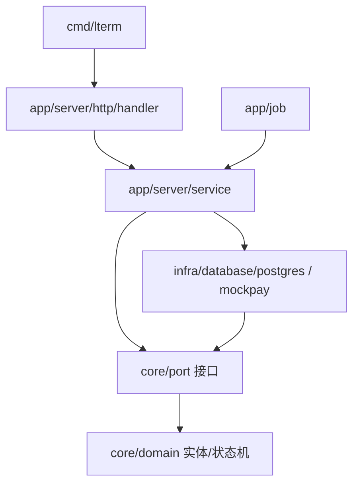

# LTerm 后端结构蓝图（对齐 potentia/backend 架构）

> 定位：给「从零自己建」的目录与文件职责。命名、分层、文件风格全部对齐真实项目 potentia/backend，不再另起一套名字。
> 参考源码：`/Users/4ge0/Desktop/code/workcode/potentia/backend/backend`（Go + Gin + GORM + MySQL 的 Clean Architecture + Modular Monolith）。

## 1. Potentia 的架构一句话

**Monorepo + Clean Architecture + Modular Monolith**：
d
- `internal/core`：纯业务领域，不依赖任何外部实现。
- `internal/infra`：外部实现（数据库、配置、日志、外部服务）。
- `internal/app`：业务流程编排（server 的 HTTP/service/biz、job 任务）。
- `cmd`：程序入口；`pkg`：通用工具；`sql/migrations`：数据库迁移。

Potentia 的核心规则：**业务逻辑（core）不依赖具体实现（infra），只依赖接口（port）**。

## 2. LTerm 目录蓝图

```text
lterm/
├── cmd/
│   └── lterm/                         # 程序入口（对齐 potentia 的 cmd/potentia）
│       ├── main.go                    #   初始化路由/依赖，启动 HTTP 与任务
│       └── commands/                  #   子命令：server / migrate / job（cobra 风格，可后加）
├── api/
│   └── docs/                          # OpenAPI/接口文档（对齐 potentia 的 api/docs）
├── internal/
│   ├── core/                          # [Domain Layer] 纯业务领域
│   │   ├── domain/                    #   实体 + 枚举 + 状态机（无框架依赖）
│   │   │   ├── order.go               #     订单实体 + 状态迁移（CanTransition）
│   │   │   ├── order_item.go          #     订单明细（票）
│   │   │   ├── payment.go             #     支付交易 + 回调实体
│   │   │   ├── refund.go              #     退款单实体
│   │   │   ├── seat_lock.dgo           #     座位锁实体
│   │   │   ├── coupon.go              #     优惠券模板/实例
│   │   │   ├── points.go              #     积分流水
│   │   │   ├── member.go              #     会员等级
│   │   │   ├── movie.go               #     影片/影院/场次/座位
│   │   │   └── user.go                #     用户/管理员
│   │   └── port/                      #   接口定义（端口）
│   │       ├── repo.go                #     OrderRepo / PaymentRepo / SeatLockRepo / CouponRepo / PointsRepo ...
│   │       ├── mockpay.go             #     支付网关接口
│   │       └── tx.go                  #     事务接口（Tx/TxManager）
│   ├── infra/                         # [Infrastructure Layer] 实现 core/port
│   │   ├── config/                    #   配置加载（对齐 potentia 的 infra/config）
│   │   ├── logger/                    #   日志
│   │   ├── database/
│   │   │   └── postgres/              #   PostgreSQL 实现
│   │   │       ├── client.go          #     连接池/事务管理器
│   │   │       ├── order_repo.go      #     实现 OrderRepo（对齐 *_repo.go 命名）
│   │   │       ├── payment_repo.go
│   │   │       ├── seat_lock_repo.go
│   │   │       ├── coupon_repo.go
│   │   │       └── points_repo.go
│   │   └── mockpay/                   #   模拟支付网关实现（实现 port/mockpay）
│   └── app/                           # [Application Layer] 业务编排
│       ├── server/                    #   云端 HTTP 服务（对齐 potentia 的 app/server）
│       │   ├── http/
│       │   │   ├── handler/           #   order_handler.go / payment_handler.go / refund_handler.go ...
│       │   │   ├── middleware/        #   鉴权 / 日志 / 恢复 / CORS
│       │   │   └── router/            #   路由注册（按模块拆分）
│       │   ├── service/               #   用例编排（对齐 *_svc.go 命名）
│       │   │   ├── order_svc.go       #     CreateOrder / HandlePaySuccess / Cancel / Refund
│       │   │   ├── payment_svc.go
│       │   │   ├── seat_svc.go
│       │   │   ├── coupon_svc.go
│       │   │   └── points_svc.go
│       │   └── biz/                   #   纯业务复杂规则（对齐 potentia 的 biz）
│       │       ├── price_calc.go      #     票价/折扣/券叠加计算
│       │       └── seat_map.go        #     座位图渲染/余座计算
│       └── job/                       #   定时任务（对齐 potentia 的 app/job）
│           ├── order_timeout.go       #   订单/锁座超时释放
│           └── reconcile.go           #   对账：订单↔交易↔积分↔票房
├── pkg/                               # 通用工具（对齐 potentia 的 pkg）
│   ├── uid/                           #   业务单号生成
│   ├── errcode/                       #   领域错误 → 业务码映射
│   └── trace/                         #   链路/日志字段
├── sql/
│   └── migrations/                    # 数据库迁移 SQL（对齐 potentia 的 sql/migrations）
├── configs/                           # 配置文件
├── docs/
├── docker-compose.yml
├── go.mod
└── Makefile
```

## 3. 命名约定（照抄 potentia 的风格）

| Potentia 实际文件 | LTerm 对应 | 干什么 |
| --- | --- | --- |
| `internal/core/domain/experiment.go` | `internal/core/domain/order.go` | 实体 + 状态枚举/迁移 |
| `internal/core/port/repo.go` | `internal/core/port/repo.go` | 所有仓储接口（DeviceRepo → OrderRepo） |
| `internal/infra/database/mysql/device_repo.go` | `internal/infra/database/postgres/order_repo.go` | 仓储实现 |
| `internal/app/server/service/device_svc.go` | `internal/app/server/service/order_svc.go` | 用例编排 |
| `internal/app/server/http/handler/device_handler.go` | `internal/app/server/http/handler/order_handler.go` | HTTP 翻译 |
| `internal/app/server/biz/scheduler/` | `internal/app/server/biz/price_calc.go` | 复杂业务规则 |
| `internal/app/job/experiment/init.go` | `internal/app/job/order_timeout.go` | 定时任务 |
| `pkg/uid` | `pkg/uid` | 通用工具 |
| `sql/migrations` | `sql/migrations` | 数据库迁移 |

## 4. 依赖方向（与 potentia 一致）



规则：

1. `core` 不 import `infra`、`app`、Gin、GORM；只依赖标准库与 `pkg`。
2. `service` 只认识 `core/port` 接口，具体实现在 `infra` 里组装后注入。
3. `handler` 只做参数绑定、鉴权、调 service、错误映射。
4. `job` 只调 service 用例，不直接改库。

## 5. 三条硬规则（决定结构优不优秀）

1. **接口在 core/port，实现在 infra**：换数据库、换支付渠道不动 service。
2. **事务由 service 开启**：通过 `port.TxManager.Run(ctx, func(tx) error)` 包裹整个用例；repo 方法接收 tx。自测：全项目搜 `BeginTx`/`Transaction(` 只能搜到 `infra/database/postgres/client.go` 一处（对齐 potentia 的 GORM 事务用法）。
3. **状态迁移只能走 core/domain**：service 先 `CanTransition`，再调 repo 的条件 UPDATE，禁止裸 UPDATE。

## 6. 为什么 potentia 这套比 handler/service/repo 强

| 能力 | handler/service/repo | potentia 结构 |
| --- | --- | --- |
| 业务规则可单测 | model 是空壳，规则散在 service | core/domain 状态机独立可测 |
| 换数据库 | service 绑死具体 repo | core/port 接口 + infra 实现 |
| 用例不膨胀 | service 越写越大 | 复杂规则抽到 biz |
| 任务可控 | 定时任务到处开事务 | app/job 只调 service |
| 命名一看就懂 | handler/service/model 混在一起 | 每层位置和职责固定 |

## 7. 自建顺序（每步一个验收点）

1. `go mod init` + `cmd/lterm/main.go` + 健康检查 → 验收：HTTP 200。
2. `internal/core/domain/order.go` 状态机 + 迁移测试 → 验收：非法迁移全被拒。
3. `internal/core/port/repo.go` + `port/tx.go` 接口 → 验收：接口不出现任何 SQL/GORM 类型。
4. `internal/infra/database/postgres/` 实现 + TxManager → 验收：全项目 `BeginTx` 只有一处。
5. `internal/app/server/service/order_svc.go` 第一个用例（HandlePaySuccess）→ 验收：单测用 Fake port 可跑。
6. `internal/app/server/http/handler/` 接路由 → 验收：HTTP → service → repo 全链路通。
7. `internal/app/job/` 超时/对账 → 验收：任务只调 service，不直接改库。
