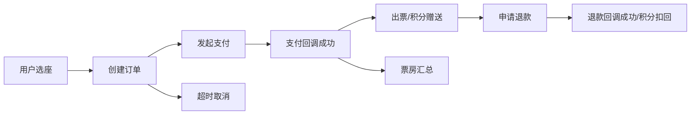
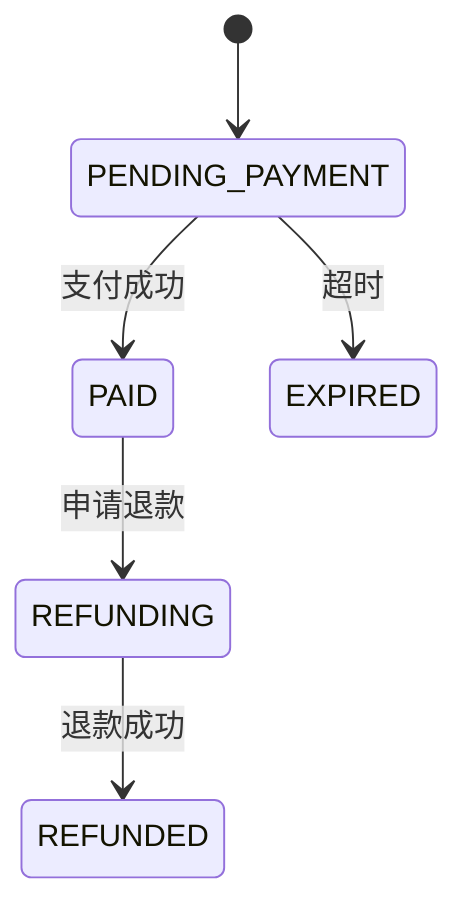
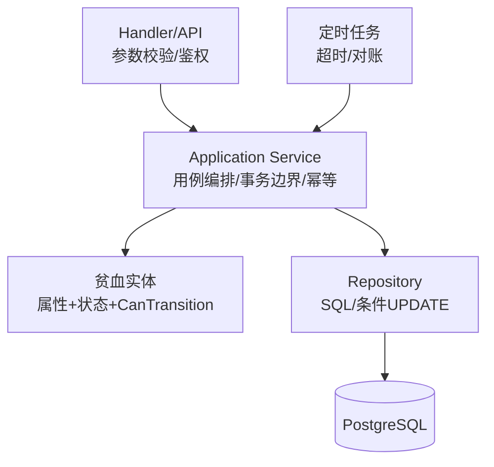

# 业务建模与贫血 DDD 学习指南

> 目标：让你真正「学会业务」，而不只是照着文档写代码。看完这篇，你应该能独立回答三个问题：
> 1. 这个系统有哪些业务事件？
> 2. 每个事件改哪些表？改什么状态？
> 3. 为什么要有这些表、这些流水、这些幂等键？

## 1. 先学会「业务」，而不是背表

业务不是一张张表，而是**事件 + 规则 + 状态**。

拿购票举例子，把系统里发生的事全部列出来：



每个事件回答三个问题：

1. **发生了什么**（事件名 + 入参）→ 对应「流水/回调记录」
2. **现在处于什么状态**（当前状态）→ 对应「状态字段」
3. **事件后要连带做什么**（副作用）→ 对应「同一事务里的多张表 UPDATE」

> 记住一句话：**流水记录事实，状态表示结论，副作用要原子**。

## 2. 四步建模法

### Step 1：列出业务事件

| 业务事件 | 谁发起 | 结果 |
| --- | --- | --- |
| 用户选座 | 用户 | 座位锁 LOCKED |
| 用户下单 | 系统 | 订单 PENDING_PAYMENT |
| 用户支付 | Mock 网关 | 支付交易 PENDING |
| 支付回调成功 | 网关 | 订单 PAID |
| 支付超时 | 定时任务 | 订单 EXPIRED |
| 用户退款 | 用户/管理员 | 退款单 PENDING |
| 退款回调成功 | 网关 | 订单 REFUNDED |

### Step 2：找实体与聚合根

把事件里的名词找出来，按「谁拥有谁」归类：

- **订单**（聚合根）：拥有订单明细（票）
- **座位锁**：隶属于场次，最终归属订单
- **支付交易**：一笔订单一次支付
- **退款单**：一笔订单一次退款
- **优惠券实例**：属于用户，最终归属订单
- **积分流水**：属于用户，事件记账

### Step 3：画状态机

每个聚合根都有状态机。这是「业务规则最浓缩的图」：



画状态机时问自己：**哪些迁移是非法的？** 比如 PAID 不能回到 PENDING_PAYMENT，这就是业务规则。

### Step 4：补流水与幂等键

对「钱」「积分」「券」这类资产，只存余额是不够的，必须存流水：

| 表 | 记录的事实 | 幂等键 |
| --- | --- | --- |
| points_ledger | 积分赠送/扣回 | (biz_type, biz_no) |
| payment_callbacks | 回调到达 | event_id |
| payment_transactions | 支付发生 | (biz_type, biz_no) |

幂等键的作用：**同一个事件重复到达时，第二次直接返回成功，不做第二次记账**。

## 3. 一张表为什么存在：五类表自查

拿到需求，先判断你要建的表属于哪一类：

| 类型 | 作用 | 例子 | 能否修改 |
| --- | --- | --- | --- |
| 主数据 | 基础信息，被引用 | users / movies / cinemas | 可改，软删除 |
| 单据 | 一笔业务的当前状态 | orders / refunds | 只能按状态机迁移 |
| 流水 | 不可变事实，审计/对账 | points_ledger / payment_callbacks | 只增不改 |
| 关系/实例 | 用户与资源的关系 | user_coupons / seat_locks | 可改状态 |
| 聚合/统计 | 读优化 | daily_box_office | 由事件更新 |

**自问清单**：

- [ ] 这个表是「事实」还是「结论」？结论必须能从事实重算出来。
- [ ] 如果删掉这个表，哪些查询会变慢/丢失审计？→ 决定是否需要流水/聚合表。
- [ ] 状态字段允许哪些迁移？有没有 CHECK 约束？
- [ ] 并发下会不会超卖/重复入账？→ 需要什么唯一索引或条件 UPDATE？
- [ ] 同一个事件来了两次，会不会出问题？→ 幂等键是什么？

## 4. 积分「赠送值 + 退款扣回」的会计直觉

很多新手设计积分会写：`users.points` 一个字段。为什么不够？

反问：用户说「我积分少了 50 分」，你拿什么回答他？没有流水，你查不到是哪笔退款扣的。

本项目积分规则拆开看：

1. **赠送**：支付成功，按实付金额赠送 → `points_ledger` 正流水。
2. **不消费**：积分不能当钱花，所以没有「消费流水」。
3. **退款扣回**：退款成功，按退款金额等比例扣 → `points_ledger` 负流水。
4. **等级只看累计赠送**：`total_earned_points` 只增，扣回只影响 `points_balance`。

为什么退款要扣回？因为积分是营销成本（负债）：买了 100 元送 100 积分，退 50 元就应收回 50 积分，否则用户反复买退就能刷积分。

为什么等级不降？因为「升级」是给用户的权益承诺，扣回的是余额、不是承诺。这是产品决策，不是技术决策——**先有业务规则，才有表设计**。

## 5. 贫血 DDD：用「用例」做调度

### 5.1 什么是贫血模型

实体（Order、Refund）**只有属性和状态**，没有复杂行为；所有流程编排放在 Application Service 的用例方法里（比如 `HandlePaySuccess`）。

优点：容易读懂、容易测试、适合事务边界清晰的中小项目。代价：实体本身不「聪明」，业务全在服务层。

### 5.2 分层



### 5.3 三个铁律

1. **一个用例 = 一个事务**：状态迁移 + 所有副作用要么全成功，要么全回滚。
2. **状态迁移必须过状态机**：先 `CanTransition`，再条件 UPDATE，禁止裸 UPDATE。
3. **副作用全部幂等**：积分、票房、回调这些「记一次账」的操作必须有唯一键。

### 5.4 最小伪代码（下单-支付-出票）

```go
func (s *OrderService) HandlePaySuccess(ctx context.Context, cb Callback) error {
    order := s.orderRepo.FindByNo(ctx, cb.BizNo)      // 1. 取贫血实体
    if !order.CanTransition(OrderEventPaySuccess) {    // 2. 状态机守卫
        return ErrOrderStateInvalid
    }
    return s.tx.Run(ctx, func(tx *sqlx.Tx) error {     // 3. 一个用例一个事务
        if !s.payRepo.InsertCallbackIfAbsent(tx, cb) { // 4. 幂等
            return nil
        }
        must(s.orderRepo.Transition(tx, order, OrderEventPaySuccess))
        must(s.seatLockRepo.MarkBooked(tx, order.ID))
        must(s.couponRepo.MarkUsed(tx, order.CouponID, order.ID))
        must(s.pointsRepo.Grant(tx, order.UserID, order.PaidCents, order.OrderNo))
        must(s.boxOfficeRepo.Upsert(tx, order))
        return s.payRepo.MarkCallbackProcessed(tx, cb.EventID)
    })
}
```

完整版见 [FSD/F0000-订单支付与退款.md](../FSD/F0000-订单支付与退款.md)。

## 6. 自己动手练习

> 建议：**先不要看 [数据库表](../database/数据库表.md)，闭卷设计，再对照**。对照时重点不是「一不一样」，而是「我少了哪一类表、少了哪个幂等键、哪个状态迁移漏了」。

### 练习 1：设计订单域

只给需求，自己画表：

- 用户选座锁定 15 分钟
- 一个订单可以买多张票
- 订单 15 分钟未支付自动取消
- 支付成功后出票码、赠送积分、统计票房
- 支持开场前整单退款，退款扣回积分

要覆盖：orders、order_items、seat_locks、payment_transactions、refunds、points_ledger。

### 练习 2：画状态机

画出 seat_locks 的完整状态机，并写出：哪些事件能让 LOCKED 变 BOOKED？哪些是非法迁移？

### 练习 3：找设计漏洞

下面的设计有什么问题？

```sql
-- 方案A：用户表直接存积分余额
ALTER TABLE users ADD COLUMN points INT DEFAULT 0;

-- 方案B：订单直接存 status，支付成功后直接 UPDATE
UPDATE orders SET status = 'PAID' WHERE order_no = 'O1';
```

答案方向：A 缺少流水、无法审计与对账；B 没有状态机守卫（PAID 订单可能被重复置为 PAID）、没有与支付/座位/积分的原子联动。

### 练习 4：对照检查

- [ ] 我有没有把「余额/结论」和「流水/事实」分开？
- [ ] 我有没有给每笔资金/积分变动留唯一幂等键？
- [ ] 我有没有用条件 UPDATE 处理并发（券核销、锁座、发放限量）？
- [ ] 我有没有把状态枚举写进 CHECK 约束？
- [ ] 我能不能对每个状态迁移讲出它的业务触发事件？

## 7. 常见误区

| 误区 | 后果 | 正确做法 |
| --- | --- | --- |
| 为了表而建表 | 过度设计、维护成本高 | 从事件反推表 |
| 状态随便 UPDATE | 脏数据、重复入账 | 状态机 + 条件 UPDATE |
| 用 FLOAT 存钱 | 金额漂移 | 分单位 BIGINT |
| 只存余额不存流水 | 无法对账、说不清来源 | 流水为主，余额为冗余快照 |
| 一个请求开多个事务 | 部分成功 = 脏数据 | 一个用例一个事务 |
| 回调直接改库 | 重复回调重复入账 | 回调先落库 + event_id 幂等 |
| 前端轮询当最终保证 | 状态不一致 | 服务端状态机 + 定时对账兜底 |

## 8. 小结

学会业务 = 能把「业务事件」翻译成「表 + 状态机 + 流水 + 幂等键」。

学会贫血 DDD = 知道把「翻译结果」放进 Application Service 的用例里，一个用例一个事务，实体只负责「我是谁、我在什么状态」。

把本项目的 docs 当练习场：每个模块都走一遍「事件 → 状态机 → 表 → 用例」四步，你就真的会了。
