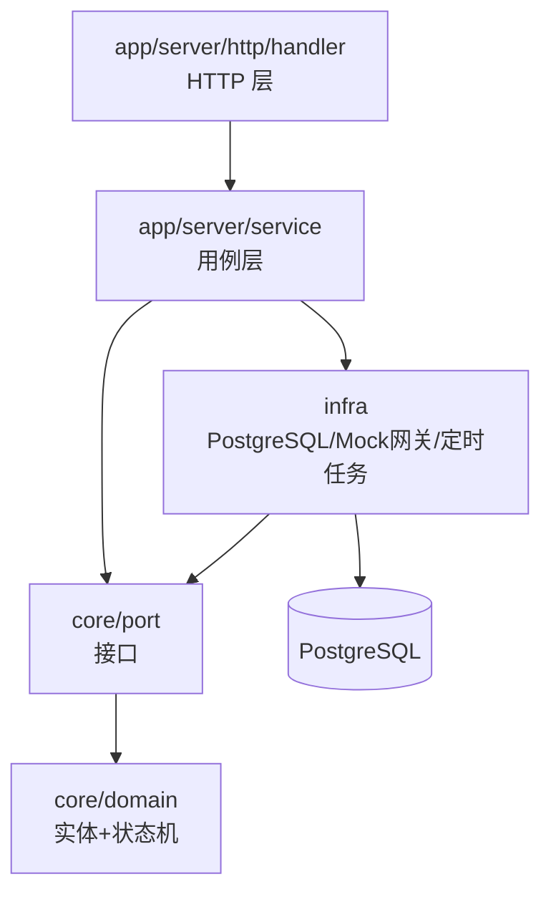

# 项目架构：贫血 DDD（对齐 potentia/backend）

> 定位：讲清楚「为什么要这样分层」。目录与命名以 [LTerm后端结构蓝图.md](LTerm后端结构蓝图.md) 为准（对齐 potentia/backend 的 core/domain + core/port + infra + app）。
> 方法论见 [业务建模与贫血DDD.md](业务建模与贫血DDD.md)，用例编排示例见 [FSD/F0000-订单支付与退款.md](../FSD/F0000-订单支付与退款.md)。

## 1. 核心思想

贫血 DDD = **实体只承载数据与状态校验，业务编排全部收进 service 的用例方法**。

依赖方向永远向下：



三条铁律：

1. `core` 不依赖任何外部框架和 `infra`，只依赖标准库。
2. `service` 依赖 `core/port` 里定义的**接口**，不依赖具体数据库实现。
3. `infra` 实现 `core/port` 的接口（适配器），永远不反向调用 `app`。

## 2. 目录结构（与 potentia 对齐）

```text
lterm/
├── cmd/lterm/                    # 入口：main.go + commands（server/migrate/job）
├── internal/
│   ├── core/
│   │   ├── domain/               # ★ 实体 + 枚举 + 状态机，无框架依赖
│   │   │   ├── order.go
│   │   │   ├── payment.go
│   │   │   ├── seat_lock.go
│   │   │   └── ...
│   │   └── port/                 # ★ 接口：repo.go / mockpay.go / tx.go
│   ├── infra/                    # ★ 适配器：database/postgres、config、logger、mockpay
│   └── app/
│       ├── server/
│       │   ├── http/             #   handler / middleware / router
│       │   ├── service/          #   order_svc.go / payment_svc.go ...
│       │   └── biz/              #   复杂业务规则（票价计算等）
│       └── job/                  #   定时任务（只调 service）
├── pkg/                          # uid / errcode / trace
├── sql/migrations/
└── configs/
```

完整文件级蓝图见 [LTerm后端结构蓝图.md](LTerm后端结构蓝图.md)。

## 3. 每层只做什么

| 层 | 允许做 | 禁止做 |
| --- | --- | --- |
| app/server/http/handler | 鉴权、参数绑定、调用 service、映射错误码 | 写业务规则、直接碰数据库 |
| app/server/service | 用例编排、开事务、幂等、调 port 接口 | 拼 SQL、写 HTTP 细节 |
| core/domain | 实体属性、状态机、不变式（金额≥0 等） | 依赖框架、碰数据库 |
| core/port | 定义接口：Repo、TxManager、MockPay | 写实现 |
| infra | 实现 port、连接池、迁移、网关、定时任务 | 定义业务规则、反向依赖 app |

## 3.1 为什么需要这一层（每层的存在理由）

分层不是规矩，是给「变化」留缝隙：**每一类变化只允许发生在某一层**。

| 层 | 类比（餐厅） | 没有它会发生什么 |
| --- | --- | --- |
| handler | 服务员：接单、传菜、解释菜单 | handler 里写满业务规则和 SQL，改接口格式会碰业务代码 |
| service | 后厨主管：安排下单、催菜、结账流程 | 状态迁移和幂等散落在各处，重复回调/并发没人兜底 |
| core/domain | 菜谱与规则：这道菜能不能做、用料是什么 | 业务规则依赖数据库框架，换数据库=业务全崩 |
| core/port | 供应商清单：我需要什么原料 | service 绑死具体实现，无法单测、无法替换 |
| infra | 供应商与仓库：食材怎么来、放哪里 | domain/service 依赖 pgx/gorm，无法单元测试 |

判断直觉：改需求时问自己「这个变化该动哪一层」——

- 换数据库/换支付渠道 → 只动 infra；
- 改业务规则（超时 15 分钟、积分比例、退款限制）→ 只动 core/domain + service；
- 改接口字段/错误码格式 → 只动 handler + 响应层。

如果某层没有任何「独立变化理由」，只有一行转发，那这层就是过度设计——分层是给变化留缝隙，不是每个 CRUD 都要四层文件。

## 4. 事务所有权（最容易写歪的地方）

**一个用例 = 一个事务；事务由 service 通过 TxManager 开启，Repository 必须接收 tx，绝不自己开事务。**

```go
// core/port/tx.go
type TxManager interface {
    Run(ctx context.Context, fn func(tx Tx) error) error
}

// core/port/repo.go
type OrderRepo interface {
    FindByNo(ctx context.Context, tx Tx, orderNo string) (*domain.Order, error)
    Transition(ctx context.Context, tx Tx, o *domain.Order, event domain.OrderEvent) error
}
```

`Tx` 由 `infra/database/postgres/client.go` 实现（pgx.Tx 或 GORM 事务，对齐 potentia 的写法）。

> 自测：在你项目里搜 `BeginTx` / `Transaction(`，应该只能搜到 `infra/database/postgres` 一处。

## 5. 状态机放 core/domain，迁移表即测试用例

```go
// core/domain/order.go（示意，不代写）
var transitions = map[Status]map[Event]Status{
    StatusPendingPayment: {
        EventPaySuccess: StatusPaid,
        EventUserCancel:  StatusCanceled,
        EventExpired:     StatusExpired,
    },
    // ...
}

func (o *Order) CanTransition(e Event) bool { ... }
```

测试清单直接来自迁移表：**每个合法迁移一个测试，每个非法迁移一个测试**。

## 6. 用例长什么样（结构示意）

```go
// app/server/service/order_svc.go（只给签名与步骤，不代写实现）
type OrderSvc struct {
    tx      port.TxManager
    orders  port.OrderRepo
    pays    port.PaymentRepo
    locks   port.SeatLockRepo
    coupons port.CouponRepo
    points  port.PointsRepo
    box     port.BoxOfficeRepo
}

func (s *OrderSvc) HandlePaySuccess(ctx context.Context, cb domain.Callback) error {
    // 1. 取实体
    // 2. CanTransition 守卫
    // 3. s.tx.Run 内：幂等 → 状态迁移 → 副作用（锁座/出票/积分/票房）
}
```

## 7. 自建顺序建议

1. `core/domain`：先写状态机和实体，再写 `core/port` 接口（不碰数据库）。
2. `app/server/service`：先写 TxManager 接口 + 第一个用例 + 单元测试（用内存 Fake port）。
3. `infra/database/postgres`：实现仓储 + 迁移 SQL。
4. `app/server/http/handler`：接第一个 handler，跑通「HTTP → service → infra」。
5. `cmd/lterm`：手动依赖注入（课程规模不需要 wire/fx）。
6. `app/job`：最后加定时任务，任务内部只调 service 用例。

## 8. 常见自建坑

| 坑 | 现象 | 修正 |
| --- | --- | --- |
| core 引入 sqlx/gorm/gin | 依赖方向倒挂 | core 只定义接口 |
| repo 自己开事务 | 用例内出现两个事务 | repo 全部接收 tx |
| service 直接拼 SQL | 业务和实现耦合 | 逻辑进用例，SQL 进 infra repo |
| handler 里写状态判断 | 状态机分散 | 迁移走 domain.CanTransition |
| 实体方法里有 `db.Query` | 贫血变充血且不可测 | 实体只做状态与计算 |
| 定时任务直接改库 | 绕过状态机 | 调 service 用例 |
| 一个包塞所有聚合 | 循环依赖/上帝包 | 按聚合分包 |

## 9. 你现在要做的

1. 按蓝图新建目录骨架，**不要复制代码**，按你自己的理解写。
2. 第一个里程碑只做：`core/domain/order.go` 状态机 + 迁移测试。
3. 跑通后发我 review，我再挑边界问题。
