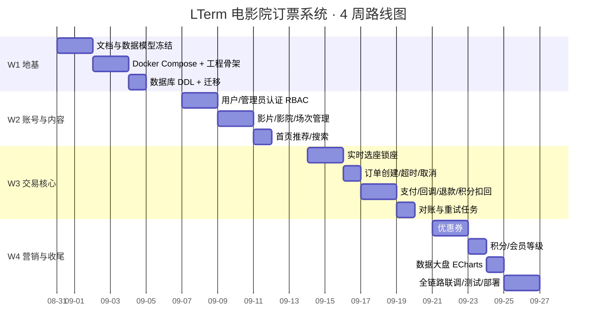

# 排期风格与里程碑（v0.1）

> 用途：统一项目排期写法，让每个迭代有明确产出、依赖、验收门禁与缓冲。

## 1. 排期风格约定

1. **里程碑（Milestone）驱动**：每个里程碑有唯一目标与可演示产出（Demoable）。
2. **迭代 = 1 周**：W1 冻结数据模型 → W2 账号/内容 → W3 交易核心 → W4 营销/大盘/联调。
3. **任务粒度 ≤ 1 人日**：超过 1 日必须拆分。
4. **依赖先行**：数据表 DDL、状态机、幂等键必须先冻结，再写业务代码。
5. **每迭代含验收门禁**：门禁不过不进下个迭代。
6. **缓冲 15%**：每个里程碑预留半天到一天处理意外（数据库坑、联调问题）。
7. **风险显式化**：排期表内标注风险与降级方案，不靠赶工兜底。

## 2. 总体路线图

## 3. 里程碑明细

### M1 地基（W1）

| 任务 | 估算 | 依赖 | 验收门禁 |
| --- | --- | --- | --- |
| PRD/数据库/状态机评审定稿 | 1d | 无 | 评审清单全部勾选 |
| Docker Compose（PostgreSQL+Gin+React） | 1d | 无 | 一键 `docker compose up` 可跑 |
| 工程骨架（分层/错误处理/日志/配置） | 1d | 上两项 | 健康检查接口返回 200 |
| 数据库 DDL 与迁移脚本 | 1d | 数据模型冻结 | 全部约束/唯一索引生效 |

### M2 账号与内容（W2）

| 任务 | 估算 | 依赖 | 验收门禁 |
| --- | --- | --- | --- |
| 用户/管理员注册登录 + JWT + RBAC | 2d | M1 | 越权 403、密码 bcrypt |
| 影片/影厅/场次/票价管理 | 2d | M1 | 同影厅时间重叠拒绝 |
| 首页推荐/影院搜索/附近 | 1d | M2 上两项 | 空态与排序正确 |

### M3 交易核心（W3）★ 本次重点

| 任务 | 估算 | 依赖 | 验收门禁 |
| --- | --- | --- | --- |
| 选座锁座（部分唯一索引） | 2d | M2 场次 | 并发同座仅一人成功 |
| 订单创建/超时/取消/释放 | 1d | 锁座 | 超时释放座位与券 |
| 订单支付/回调（Mock 直付） | 2d | 订单 | 重复回调不重复入账 |
| 退款 + 积分扣回 + 对账/重试任务 | 1d | 支付 | 对账偏差 = 0 |

### M4 营销与收尾（W4）

| 任务 | 估算 | 依赖 | 验收门禁 |
| --- | --- | --- | --- |
| 优惠券（模板/发放/核销） | 2d | M3 订单 | 并发核销仅一单成功 |
| 积分/会员等级 | 1d | M3 支付 | 升级/折扣快照正确 |
| 数据大盘 + ECharts 折线图 | 1d | M3 支付 | 时间/影片/影院过滤正确 |
| 全链路联调/测试/部署 | 2d | 以上全部 | 北极星指标达标 |

## 4. 风险与缓冲

| 风险 | 影响 | 应对 | 缓冲 |
| --- | --- | --- | --- |
| 数据库约束设计返工 | 全链路延期 | W1 冻结评审，DDL 先行 | M1 预留 0.5d |
| 回调/并发测试难复现 | 交易可靠性存疑 | 写并发测试脚本，模拟重复回调/同座抢座 | M3 预留 1d |
| 前端 ECharts 联调慢 | 大盘延期 | 大盘先出 JSON，再渲染图表 | M4 预留 0.5d |
| 部署环境差异 | 交付延期 | Docker 固定版本，避免本机依赖 | M4 预留 0.5d |

## 5. 每日/每周节奏

- 每日：`早 10 分钟同步阻塞 + 下班前提交可运行片段`
- 每周五：里程碑演示 + 更新本文档 + 记录决策日志（PRD §11）
