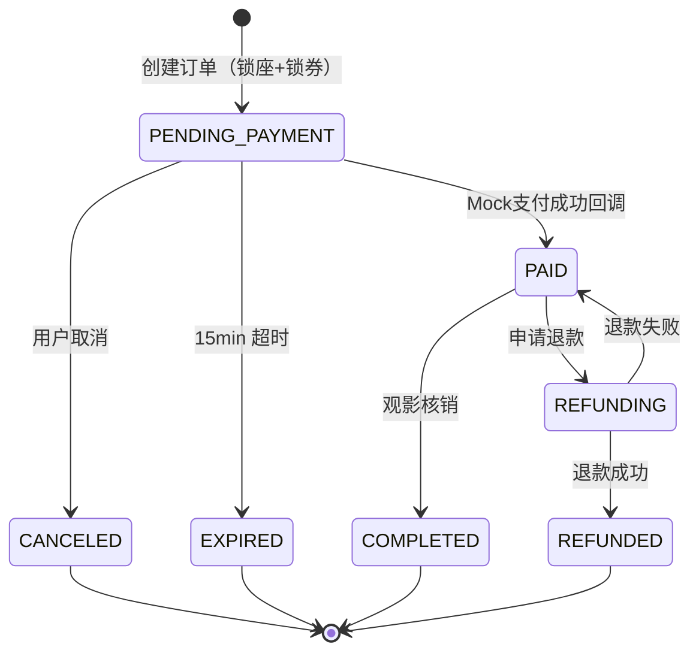
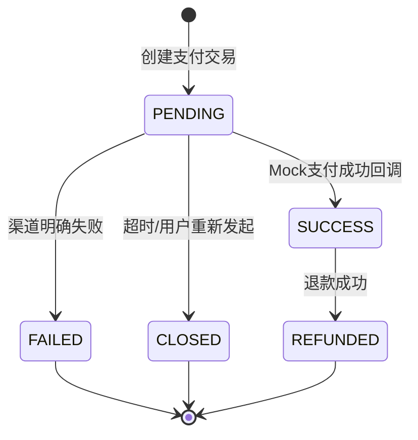
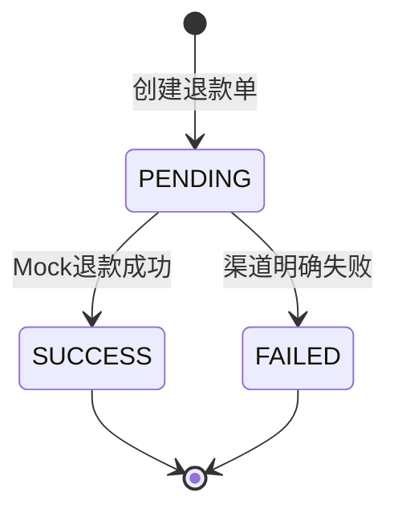
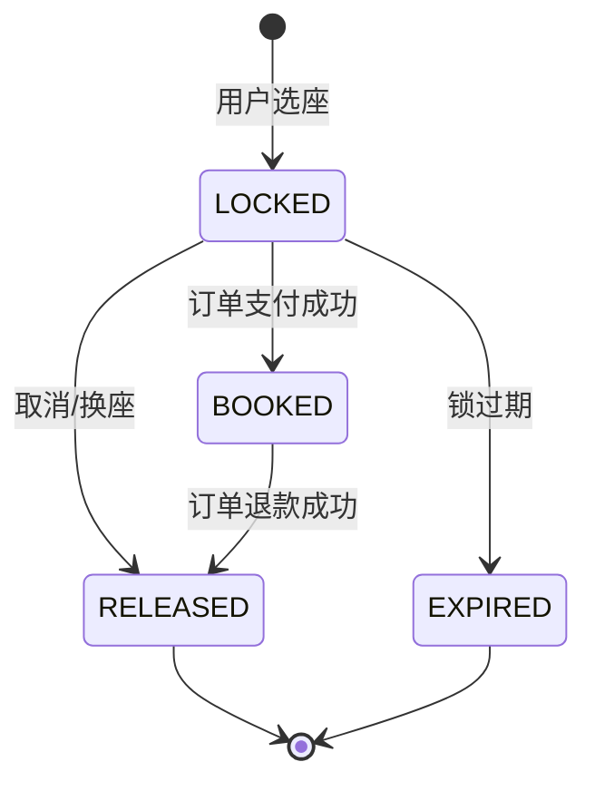
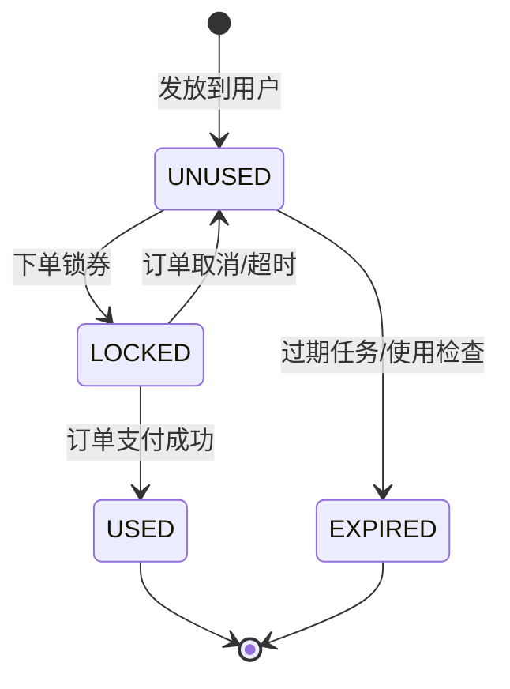
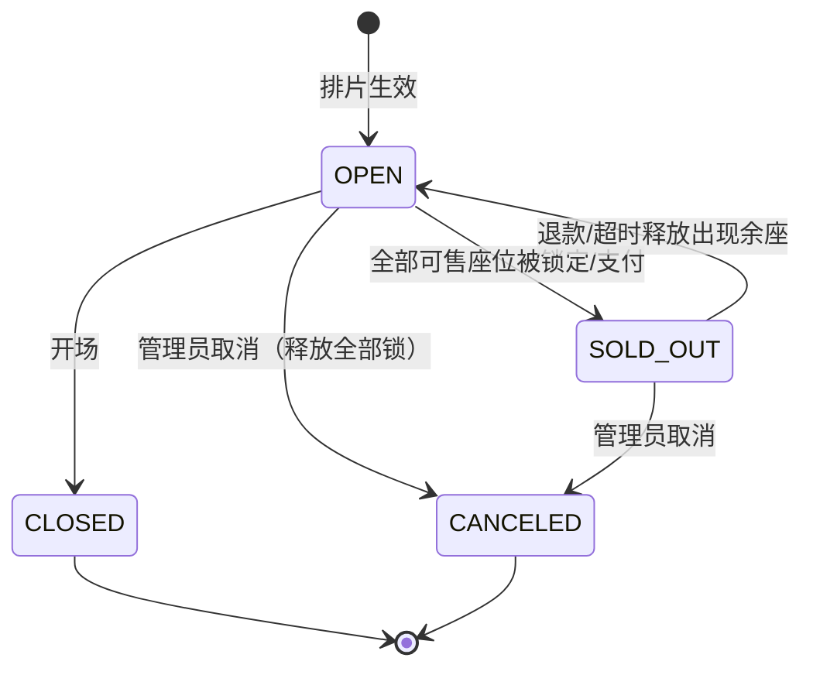

# 状态机全集（v0.2 草稿）

> 配套 PRD：[P0000-电影院订票系统](../PRD/P0000-电影院订票系统.md)；表结构：[数据库表](../database/数据库表.md)
> 约定：所有状态迁移只允许在服务层状态机内发生；非法迁移返回 409；状态迁移必须与资金/资源变更处于同一数据库事务。
> v0.2：已移除钱包/充值状态机；新增退款单状态机；积分退款扣回。

## 1. 订单状态机（orders.status）

| 当前状态 | 事件 | 目标状态 | 守卫条件 | 副作用（同一事务） |
| --- | --- | --- | --- | --- |
| PENDING_PAYMENT | 支付成功回调 | PAID | 金额校验通过、交易流水 SUCCESS | 锁座 BOOKED、生成 ticket_no、积分赠送、票房 upsert、优惠券 USED |
| PENDING_PAYMENT | 用户取消 | CANCELED | 用户本人/超管 | 释放座位锁、优惠券回 UNUSED |
| PENDING_PAYMENT | 超时任务 | EXPIRED | now() > expire_at | 同上 |
| PAID | 观影核销 | COMPLETED | 开场后、票未核销 | order_items.used_at |
| PAID | 申请退款 | REFUNDING | 开场前、无进行中退款 | 创建 refunds(PENDING) |
| REFUNDING | 退款成功 | REFUNDED | 退款单 SUCCESS | 座位释放、积分扣回、票房扣净额、交易 REFUNDED |
| REFUNDING | 退款失败 | PAID | 渠道失败 | 退款单 FAILED，订单保持已支付 |

**边界**：PAID 订单不可重复支付；PENDING_PAYMENT 收到回调但金额不符→拒绝并告警；订单状态与支付流水状态必须一致（对账任务校验）。

## 2. 支付交易状态机（payment_transactions.status）

| 当前状态 | 事件 | 目标状态 | 守卫条件 |
| --- | --- | --- | --- |
| PENDING | 回调 success | SUCCESS | event_id 唯一、金额一致、订单状态机可前进 |
| PENDING | 回调 fail / 渠道拒绝 | FAILED | 渠道明确失败 |
| PENDING | 超时 / 用户重发支付 | CLOSED | 未支付且过期 |
| SUCCESS | 退款成功 | REFUNDED | 对应 refunds SUCCESS |

**边界**：`UNIQUE(biz_type,biz_no)` 保证一单一付；`UNIQUE(channel, external_trade_no)` 防渠道重复；PENDING 兜底由对账任务关闭。

## 3. 退款单状态机（refunds.status）

| 当前状态 | 事件 | 目标状态 | 守卫条件 | 副作用 |
| --- | --- | --- | --- | --- |
| PENDING | 退款成功 | SUCCESS | 订单 REFUNDING、金额=实付 | 订单→REFUNDED、交易→REFUNDED、锁释放、积分扣回、票房扣净额 |
| PENDING | 退款失败 | FAILED | 渠道明确失败 | 订单回到 PAID |

**边界**：一单一退（order_id UNIQUE）；退款幂等（refund_no 唯一 + 状态条件 UPDATE）；退款成功后不重复扣积分（points_ledger 唯一键）。

## 4. 座位锁状态机（seat_locks.status）

| 当前状态 | 事件 | 目标状态 | 守卫条件 |
| --- | --- | --- | --- |
| LOCKED | 支付成功 | BOOKED | 订单 PAID |
| LOCKED | 用户取消/换座 | RELEASED | lock_token 匹配 |
| LOCKED | 定时任务 | EXPIRED | now() > expires_at |
| BOOKED | 退款成功 | RELEASED | refunds SUCCESS |

**边界**：部分唯一索引 `(session_id, seat_id) WHERE status IN ('LOCKED','BOOKED')` 是防超卖的最后防线；RELEASED/EXPIRED 后同一座位可被再次锁定。

## 5. 优惠券状态机（user_coupons.status）

| 当前状态 | 事件 | 目标状态 | 守卫条件 |
| --- | --- | --- | --- |
| UNUSED | 下单 | LOCKED | 条件 UPDATE 影响行数=1（原子抢占） |
| LOCKED | 支付成功 | USED | 订单 PAID |
| LOCKED | 取消/超时 | UNUSED | 订单非 PAID |
| UNUSED | 过期 | EXPIRED | now() > expire_at |

**边界**：同一券并发用于两单，只有一个 UPDATE 成功；退款后默认不返还（模板规则可配）。

## 6. 场次状态机（show_sessions.status）

**边界**：CANCELED 需二次确认并触发全量释放任务；CLOSED/CANCELED 后不可创建新订单。

## 7. 全局兜底任务

| 任务 | 周期 | 行为 | 幂等保障 |
| --- | --- | --- | --- |
| 订单超时释放 | 1min | PENDING_PAYMENT 过期→EXPIRED，释放锁/券 | 状态条件 UPDATE |
| 座位锁过期 | 1min | LOCKED 过期→EXPIRED | 状态条件 UPDATE |
| 回调重试 | 指数退避 | FAILED/RECEIVED 未处理→重试 ≤5 次 | event_id 唯一 |
| 对账任务 | 5min | 校验：订单 PAID ↔ 交易 SUCCESS ↔ 锁 BOOKED ↔ 积分流水存在 ↔ 票房一致；不一致按事件补齐 | 唯一幂等键 |
| 优惠券过期 | 1h | UNUSED 过期→EXPIRED | 条件 UPDATE |

## 8. 状态机实现建议

- 状态表驱动：定义 `transition_map[from][event] = to`，非法迁移统一 409 + 日志。
- 每个状态迁移封装为 service 方法，内部必须开启数据库事务。
- 所有状态字段加 CHECK 约束；测试覆盖「每个合法迁移 + 每个非法迁移」。
